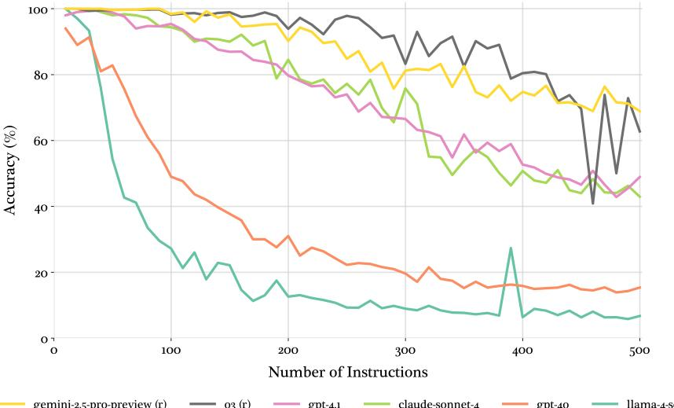
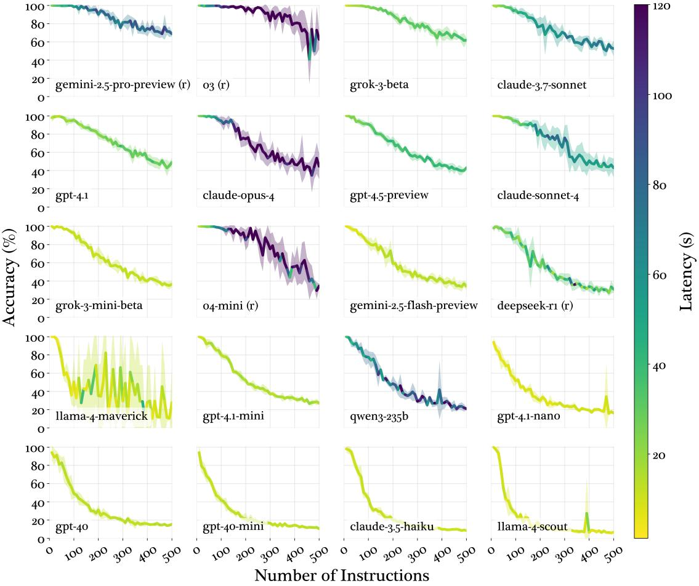
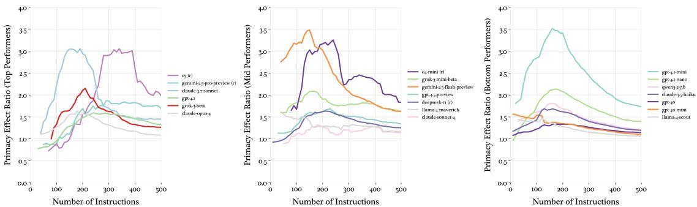
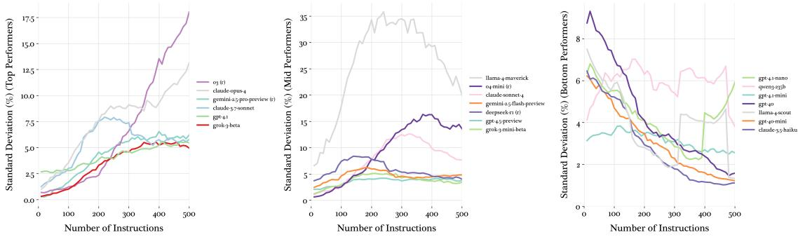
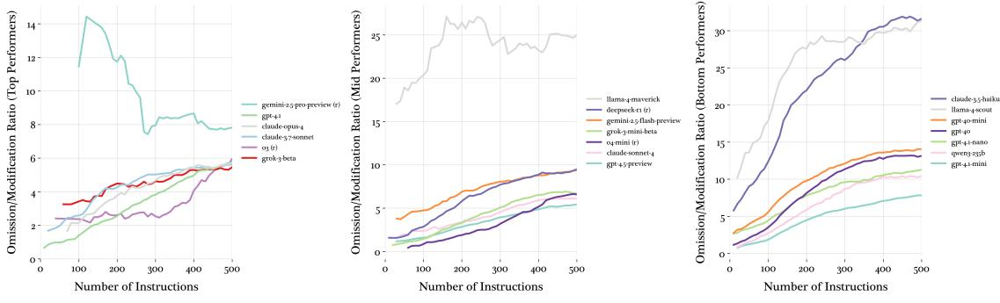
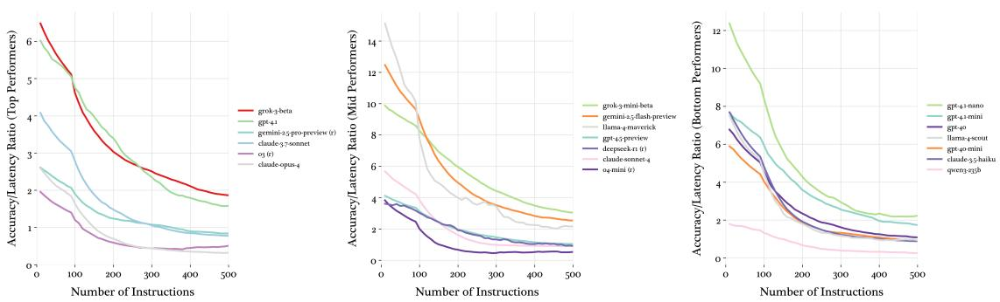
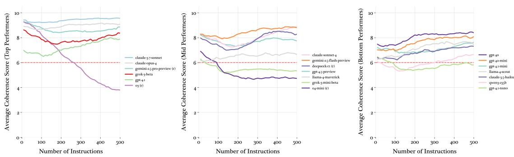
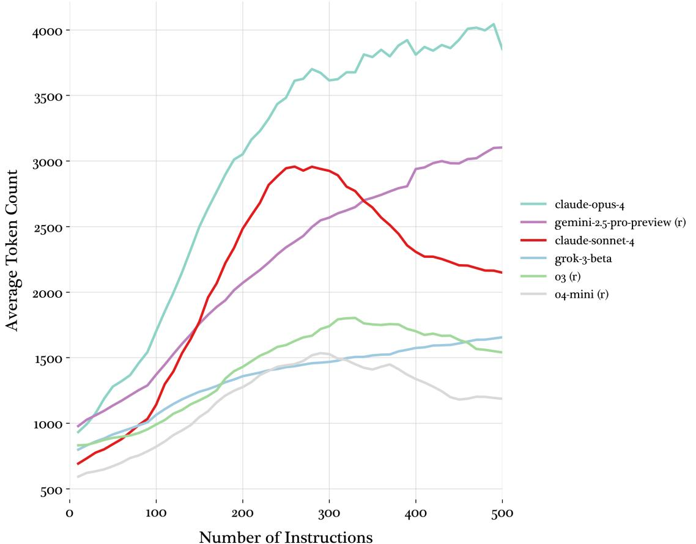
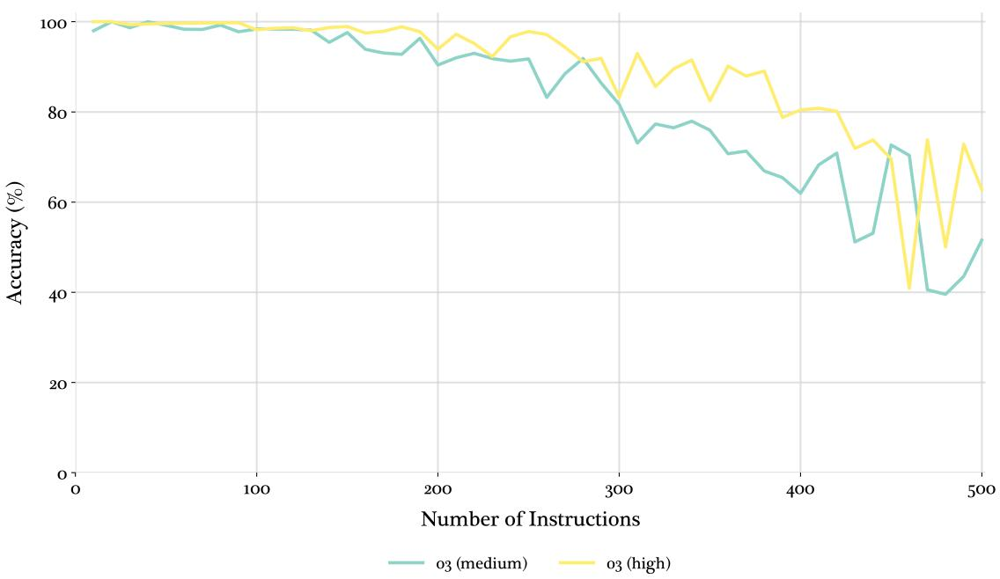
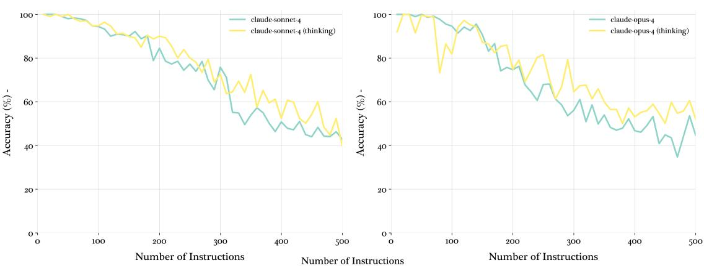

# HOW MANY INSTRUCTIONS CAN LLMS FOLLOW AT ONCE?

Daniel Jaroslawicz1 Brendan Whiting1 Parth Shah1 Karime Maamari1 1Distyl AI {daniel, brendan, parth, karime}@distyl.ai

## ABSTRACT

Production-grade LLM systems require robust adherence to dozens or even hundreds of instructions simultaneously. However, the instruction-following capabilities of LLMs at high instruction densities have not yet been characterized, as existing benchmarks only evaluate models on tasks with a single or few instructions. We introduce IFScale, a simple benchmark of 500 keyword-inclusion instructions for a business report writing task to measure how instruction-following performance degrades as instruction density increases. We evaluate 20 state-of-the-art models across seven major providers and find that even the best frontier models only achieve 68% accuracy at the max density of 500 instructions. Our analysis reveals model size and reasoning capability to correlate with 3 distinct performance degradation patterns, bias towards earlier instructions, and distinct categories of instruction-following errors. Our insights can help inform design of instruction-dense prompts in real-world applications and highlight important performancelatency tradeoffs. We open-source the benchmark and all results for further analysis at https://distylai.github.io/IFScale.



Figure 1: Model instruction-following accuracy across increasing densities, averaged over 5 runs. Three distinct degradation patterns emerge: (1) threshold decay—near-perfect performance until a critical density, then rising variance and decreased adherence (reasoning models like o3, gemini-2.5-pro), (2) linear decay (gpt-4.1, claude-sonnet-4), and (3) exponential decay (gpt-4o, llama-4-scout).

## 1 INTRODUCTION

As large language models (LLMs) are increasingly being deployed in production systems requiring precise specification adherence, understanding their limitations is essential for reliable operation (Ouyang et al., 2022; Sanh et al., 2022; Wei et al., 2022; Song et al., 2025). From content generation systems that must adhere to style guidelines and factual requirements, to automated workflows that integrate dozens of business rules and compliance standards, to agentic systems requiring robust memory layers and tool usage, modern applications demand models that can execute complex tasks while satisfying multiple simultaneous instructions (de Langis et al., 2024; Kulkarni, 2025; Xu et al., 2025). Real-world failures, such as chatbots inventing non-existent policies or providing misleading advice, highlight the operational and legal risks of imperfect instruction following.

This challenge has become pressing as recent advances dramatically expand what we can feasibly ask models to handle. Context windows have grown from thousands to millions of tokens (Team, 2024), and reasoning capabilities over extended contexts have improved (OpenAI, 2024; DeepSeek-AI, 2025). These developments theoretically enable single-call requests with many simultaneous instructions, rather than the standard paradigm requiring careful decomposition or retrieval (Chung et al., 2025; Chan et al., 2025; Maamari et al., 2024). To confidently move towards increased instruction density, we must first answer: how many instructions can models actually handle before performance meaningfully degrades?

Existing instruction-following benchmarks provide limited insight into this question. Early evaluations typically assessed models using simpler tasks or small numbers of instructions per request (Wang et al., 2022; Mishra et al., 2022). Recent benchmarks have advanced in complexity and realism (Maamari et al., 2024; Jiang et al., 2024; Madaan et al., 2023; He et al., 2024; Qin et al., 2024; Zeng et al., 2024; Jing et al., 2023), but still focus on scenarios with few instructions. This leaves a gap in understanding around performance degradation under the high instruction densities that expanded model capabilities now theoretically support. To address this gap, we introduce IFScale, a benchmark designed to characterize how models handle increases in cognitive load.

The main contributions of this work include: (1) IFScale: a benchmark for evaluating instruction-following performance as instruction density increases; (2) Comprehensive evaluation: an evaluation revealing performance hierarchies and degradation patterns across state-of-the-art models and a detailed exploration of instruction ordering effects, error types, and task performance under high cognitive load for all models considered.

## 2 RELATED WORK

#### 2.1 EVALUATION OF LLM INSTRUCTION FOLLOWING

Evaluation of LLM instruction following capabilities is essential to ensure that model outputs align closely with human intentions, an area increasingly explored through recent benchmarks (Lou et al., 2024; Zeng et al., 2024; Liu et al., 2025). Early approaches like FLAN, InstructGPT, and large-scale benchmarks such as Super-NaturalInstructions have advanced our understanding by showcasing enhanced alignment and generalization from task-tuning (Wei et al., 2022; Ouyang et al., 2022; Wang et al., 2022). However, these benchmarks have predominantly assessed performance using simpler or smaller-scale tasks, limiting understanding of model behavior under higher-density instruction scenarios.

#### 2.2 RECENT BENCHMARKS ON COMPLEX INSTRUCTION FOLLOWING

Several recent benchmarks have advanced the complexity and realism of LLM evaluation by explicitly exploring scenarios involving multiple tasks or instructions. For instruction following, ComplexBench and FollowBench evaluate LLM performance on complex instructions composed of multiple constraints (Wen et al., 2024; Jiang et al., 2024). DC-Instruct introduced methods to explicitly handle interdependent or multi-intent tasks, highlighting improvements with structured approaches (Xing et al., 2024). However, these benchmarks generally fail to explore how model performance degrades in many instruction scenarios.

### 2.3 EVALUATIONS OF INSTRUCTION COMPLEXITY

Recent studies have highlighted that instruction complexity influences model performance and robustness. For example, DIM-Bench demonstrated that LLMs are vulnerable to negative or distractor requirements (Hwang et al., 2025). Recent work has also shown that order effects matter in instruction following, with items presented earlier receiving more attention (Zeng et al., 2025; Liu et al., 2025; Wen et al., 2024). Yet, these evaluations typically examine instruction complexity at low densities, without exploring larger-scale combinations of instructions.

Our benchmark addresses these limitations by evaluating performance at increased instruction densities, providing insight into performance cliffs and degradation patterns not observable in single- or few-instruction evaluations.

## 3 IFSCALE

We propose IFScale, a benchmark designed to investigate how model performance degrades as instruction density increases. The task is to generate a professional business report while including a set of keywords in the output. Each instruction is a constraint to include a specific keyword in the generated report. This allows us to easily scale instruction density from 10 to 500 instructions with a step size of 10 and automatically grade performance by keyword inclusion.

## 3.1 TERM VOCABULARY CONSTRUCTION

We compile a high-precision vocabulary of business-relevant one-word instructions from U.S. SEC 10-K filings. For each filing, we prompt o4-mini to extract the top 500 candidate terms as a JSON list. Extracted lists are fuzz-match deduplicated. A look-back validation step retains only terms found as whole words in the raw 10-K corpus, to avoid any improper extraction by the model. We then filter by Zipf frequency (≥ 1.0) to ensure all terms exist in standard English terminology. Morphological variants are collapsed to a single lemma via WordNet lemmatization. To guard against semantic redundancy, we embed all remaining terms using OpenAI's text-embedding-3-small, compute each term's nearest-neighbor cosine distances, and prune any term whose distance falls below the mean. Finally, we estimate each lemma's generation "difficulty" by averaging exp(− avg_logprob) over three zero-temperature gpt-4.1-nano completions, rank by descending perplexity, and select the top 500 terms as our final rule vocabulary (Appendix E).

## 3.2 IMPLEMENTATION DETAILS

For each experiment, we evaluate a grid of instruction densities N ∈ {10, 20, . . . , 500} under five random seeds.

- Prompt construction: Sample N keywords from the pruned vocabulary and create a list of instructions of the form: "Include the exact word {keyword}". Instruct the model to build a multi-section professional business report while obeying the list of instructions (Appendix D).
- Retry logic: Issue each prompt to the respective model with retries when lists of constraints (≥10 commaseparated single words), response refusals (<20 words), or incoherent reports (validated by a secondary o4-mini coherence check) are identified.

- Evaluation: Evaluate each report's adherence via wildcard-enabled regex matching on the text.
## 4 EXPERIMENTS

## 4.1 EXPERIMENTAL SETUP AND METRICS

We evaluated a total of 20 models spanning seven providers, as highlighted in Fig. 2. We evaluated each model via the OpenRouter API using default generation parameters to maintain natural generation characteristics. We set reasoning effort to "high" where applicable. Five independent random seeds were run per instruction density level (N ∈ {10, 20, . . . , 500}), and stratified sampling ensured consistent difficulty across runs.

## 4.2 EVALUATION METHODOLOGY

We assess each generated report's adherence to its instructions via deterministic pattern matching. First, we perform case-insensitive, style-insensitive exact-match searches using regular expressions to identify proper keyword inclusions. Instructions not found are counted as omission errors. Instructions matching at least an 80%-length prefix of each term are counted as modification errors. We compute per-model and per-density omission and modification rates by aggregating across seeds. To quantify primacy effects, we partition each instruction list into early, middle, and late thirds and measure error rates within each bucket. Standard deviation is computed by taking the sample standard deviation of accuracy scores across the five random seeds at each density level.

## 4.3 PERFORMANCE ANALYSIS

Figure 2 displays model performance patterns across the instruction density spectrum, while Appendix A presents comprehensive metrics across multiple dimensions.

Generally, reasoning models (indicated in all figures by "(r)" appended to model name) outperform their general-purpose counterparts. They maintain near-perfect performance through moderate densities (100-250 instructions) before degradation, suggesting that reasoning capabilities provide advantages for instruction tracking and satisfaction (see appendix C for further reasoning model analysis). Also, naturally, newer generation general-purpose models generally outperform their older-generation counterparts, and larger models outperform smaller counterparts.

However, several outliers challenge these general trends. grok-3 (61.9% at 500 instructions) approaches the performance of o3 (62.8%) with significantly less variance, despite not being run in reasoning mode. claude-3.7-sonnet outperforms the newer claude-opus-4 and claude-sonnet-4 at max density (52.7% vs. 44.6% and 42.9% respectively). Additionally, deepseek-r1 (30.9%) underperforms given its reasoning model classification, and qwen3 (26.9%) falls short of expectations for a large, new-generation model. Finally, gpt-4o displays surprisingly weak performance, showing rapid decay more characteristic of small models like gpt-4.1-nano.

## 4.4 DEGRADATION PATTERN ANALYSIS

Analysis of accuracy degradation curves reveals three distinct patterns as shown in Fig. 1:

Threshold decay: Performance remains stable until a threshold, then transitions to a different (steeper) degradation slope and displays increased variance. The top two models (gemini-2.5-pro, o3) demonstrate this clearly, maintaining near-perfect performance through 150 or more instructions before declining. Notably, these are both reasoning models, indicating that deliberative processing architectures provide robust instruction tracking up to critical thresholds, beyond which systematic degradation occurs.



Figure 2: Model performance degradation as instruction density increases from 10 to 500 instructions, with line coloring representing generation latency and shading indicating ±1 standard deviation across five runs. Models are ordered by accuracy at 500 instructions. Larger or newer models and models with reasoning tend to outperform smaller or earlier generation models that show rapid early degradation.

Linear decay: Characterized by steady, predictable decline in performance. gpt-4.1 and claude-3.7-sonnet exemplify this pattern, with accuracy decreasing approximately linearly across the density spectrum.

Exponential decay: Characterized by rapid early degradation followed by performance stabilization at low accuracy floors. Models like claude-3.5-haiku and llama-4-scout exemplify this pattern, showing steep performance drops after minimal instruction densities before asymptotically approaching consistent low-performance baselines. Notably, all exponential decay patterns appear to level off around similar accuracy floors (7-15%), suggesting lower bounds on instruction satisfaction.

#### 4.5 VARIANCE PATTERNS

We examine performance variance across the five runs per instruction density level and observe three distinct behaviors as shown in Appendix B.3: Top performing models by accuracy (e.g. gemini-2.5-pro, o3, grok-3-beta) display steady increases in variance, indicating reduced reliability as instruction density increases. Mid-tier performing models (e.g. gemini-2.5-flash, claude-sonnet-4) show midrange variance peaks in the 150-300 instruction range suggesting a critical capacity zone where performance is unstable before the model collapses under cognitive load and stabilizes at consistently poor performance. Finally, the worst performing models almost immediately decrease in variance suggesting that they are overwhelmed by even a few dozen instructions. We can infer that variance decreases as models collapse under cognitive load, and that the top performing models do not yet collapse at 500 instructions. We note that llama-4-maverick stands out as an extreme outlier with abnormally high variance, suggesting different instruction-processing mechanisms.

#### 4.6 PRIMACY EFFECTS

Primacy effects refer to the tendency of models to better satisfy instructions appearing earlier versus later in the instruction list (Guo & Vosoughi, 2024; Zhou et al., 2024; Horowitz & Plonsky, 2025). We compute primacy effects as the ratio of error rates in the final third of instructions to error rates in the first third of instructions. A ratio greater than 1.0 indicates that later instructions are more likely to be violated.

Primacy effects display an interesting pattern across all models: they start low at minimal instruction densities indicating almost no bias for earlier instructions, peak around 150-200 instructions, then level off or decrease at extreme densities. This mid-range peak suggests that models exhibit the most bias as they begin to struggle under cognitive load at moderate densities. However, at extreme densities (300+ instructions), primacy effects uniformly diminish across all models, with most ratios converging toward 1.0–1.5 (see Appendix A and Fig. 3). This convergence indicates a shift from selective instruction satisfaction to more uniform failure patterns when completely overwhelmed, indicating an instruction saturation point. Therefore, while packing more important instructions towards the beginning of a prompt may help, it becomes a less effective strategy once extreme densities are reached.

#### 4.7 EFFICIENCY ANALYSIS

Most production applications have some latency constraints even if they do not demand real-time interaction. We analyze generation latency and accuracy tradeoffs as instruction density increases. Reasoning models exhibit the most pronounced latency increases under cognitive load: o4-mini scales dramatically from 12.40s at 10 instructions to 436.19s at 250 instructions and o3 increases from 26.30s to 219.58s at 250 instructions. In contrast, general-purpose models maintain stable latency profiles: claude-3.5-haiku ranges from 9.32s to 10.54s, gpt-4o remains between 9.29s and 13.20s (Appendix A).

The accuracy-to-latency efficiency ratio reveals practical deployment insights that pure accuracy metrics obscure (Appendix B.3). All models show declining efficiency as instruction density increases, with universal convergence toward low ratios (0-2) at high densities. However, efficiency hierarchies differ markedly from accuracy hierarchies. Fast, smaller models like grok-3-mini, gemini-2.5-flash, and gpt-4.1-nano achieve the highest efficiency ratios, demonstrating that computational speed can compensate for moderate accuracy losses in time-sensitive applications. Larger reasoning models like o3 and gemini-2.5-pro exhibit lower efficiency ratios than several smaller models, suggesting their computational costs may outweigh accuracy benefits for practical deployment. Notably, grok-3 maintains a high efficiency ratio and strong accuracy performance.

Model selection for high-density instruction scenarios should balance accuracy requirements with computational constraints, as the highest-performing models may not provide optimal efficiency for large-scale



Figure 3: Primacy effect ratios showing universal attention degradation patterns regardless of instructionfollowing performance. Nearly all models exhibit mid-range peaks around 150-200 instructions where selective attention mechanisms favor earlier instructions, followed by convergence toward uniform failure patterns at extreme densities. The convergence indicates a fundamental shift from selective to universal instruction abandonment. Curves are smoothed by a rolling window of size 3.

deployment. For instance, real-time customer service chatbots handling multiple simultaneous constraints require rapid response times that may favor efficient models over maximally accurate ones.

#### 4.8 ERROR TYPE ANALYSIS

We evaluate two types of instruction violations:

Omission errors: Complete failure to include required terms in the generated text. For example, when instructed to include "accountability" but the term appears nowhere in the output.

Modification errors: Inclusion of morphological variants rather than exact required terms. For example, including "accountable" or "accounts" when "accountability" was required, or "strategic" when "strategy" was required.

Models overwhelmingly err toward omission errors as instruction density increases. At low densities, many models show relatively balanced error types, but this shifts dramatically at high densities. At 500 instructions, llama-4-scout exhibits an extreme O:M ratio of 34.88, indicating omission errors are over 30 times more frequent than modification errors (Appendix B.2).

Three models demonstrate strong omission bias compared to others: llama-4-maverick, claude-3.5-haiku, and llama-4-scout. These models show O:M ratios consistently above 20-30 across multiple density levels, suggesting their failure mode defaults to complete instruction dropping rather than attempting morphological approximations. In contrast, reasoning models like o3 and o4-mini maintain lower O:M ratios even at high densities, indicating they attempt to satisfy instructions through modifications rather than complete omission when under increased load. gemini-2.5-pro stands out as the only model to actually decrease its O:M ratio as instruction density increases.

#### 4.9 CORE TASK PERFORMANCE ANALYSIS

We investigate how performance on our core task (writing a coherent business report) degrades as instruction density increases. We are interested in determining if cognitive resources spent on instruction adherence negatively impact a model's ability to carry out the core task it is attempting. In order to measure core task performance, we have o4-mini judge the coherence of the generated business report using a coherence rubric (B.4.1) across all attempted generations–not just those generations that met our threshold of coherence to be considered a valid output as described in 3.2. We do not find clear evidence of coherence decreasing significantly as instruction density increases for the majority of models. Almost all models maintain coherence or only display a slight dip as they strain under cognitive load (Appendix B.4).

However, o3 and o4-mini stand out as the only two outliers. They show marked declines in coherence as density increases and dip below our threshold coherence score of 6 that defines a plausible business report. While this may indicate the o-series of models is susceptible to core task performance degradation while focused on instruction following, it is likely that part of the explanation is the o-series' reluctance to generate a large amount of output tokens. As seen in Appendix B.4.2, o3 and o4-mini output significantly less tokens than all top performing models except for grok-3. At 500 instructions, o3 is only outputting 1500 tokens, meaning that every third generated word must be a keyword–an obvious strain on coherence. Remarkably, grok-3 maintains high coherence despite outputting a similar number of tokens (B.4.3).

## 5 DISCUSSION

Our analysis reveals insights for deploying LLMs in instruction-heavy scenarios. The identification of distinct degradation patterns provides a framework for model selection based on application requirements: threshold degraders for applications requiring high instruction counts with near-perfect recall, linear degraders for predictable performance trade-offs, and recognition that smaller models may suffice for low-instruction scenarios despite steep early degradation.

The universal mid-range peak in primacy effects suggests an architectural limitation rather than modelspecific behavior, with immediate practical implications for instruction ordering strategies. The convergence of primacy effects at extreme densities indicates that traditional prompt engineering becomes less effective as models become overwhelmed.

Standard deviation patterns reveal that model reliability varies uniquely with instruction density. Practitioners should select models based not only on mean accuracy but also on variance patterns matching their reliability requirements, with consistent performers preferred for mission-critical applications.

## 6 CONCLUSION AND LIMITATIONS

We introduce IFScale, a benchmark measuring instruction-following performance degradation as instruction load scales from 10 to 500 instructions. Our analysis reveals several patterns: reasoning models dominate at extreme densities, three distinct degradation curves (threshold, linear, exponential), universal primacy effects indicating attention limitations, and systematic error shifts from modification to omission under cognitive load. We also raise questions around whether core task performance may degrade as instruction density increases.

Our study has several important limitations. We focus exclusively on professional report generation with simple keyword-inclusion instructions, which may not generalize to other task types or domains, or more complex instruction types. Our business vocabulary from SEC 10-K filings limits insights into other instruction formats common in real applications. Results are specific to English-language, business-domain instruction following, with cross-lingual performance and other paradigms requiring future investigation.

Future work should investigate the complete degradation mechanisms underlying our observed patterns, explore instruction types beyond simple constraints, determine whether these degradation curves generalize across tasks, and further examine the tension between instruction following and core task performance, particularly in OpenAI's o-series. Our findings indicate that instruction-following represents a critical dimension of LLM cognitive capacity amenable to targeted improvements.

## REFERENCES

- Brian J. Chan, Chao-Ting Chen, Jui-Hung Cheng, and Hen-Hsen Huang. Don't do rag: When cacheaugmented generation is all you need for knowledge tasks. In *Companion Proceedings of the ACM on Web Conference 2025*, WWW '25, pp. 893–897. ACM, May 2025. doi: 10.1145/3701716.3715490. URL http://dx.doi.org/10.1145/3701716.3715490.
- Yeounoh Chung, Gaurav T. Kakkar, Yu Gan, Brenton Milne, and Fatma Ozcan. Is long context all you need? leveraging llm's extended context for nl2sql, 2025. URL https://arxiv.org/abs/2501.12372.
- Karin de Langis, Ryan Koo, and Dongyeop Kang. Dynamic multi-reward weighting for multi-style controllable generation, 2024. URL https://arxiv.org/abs/2402.14146.
- DeepSeek-AI. Deepseek-r1: Incentivizing reasoning capability in llms via reinforcement learning, 2025. URL https://arxiv.org/abs/2501.12948.
- Xiaobo Guo and Soroush Vosoughi. Serial position effects of large language models, 2024. URL https: //arxiv.org/abs/2406.15981.
- Yun He, Di Jin, Chaoqi Wang, Chloe Bi, Karishma Mandyam, Hejia Zhang, Chen Zhu, Ning Li, Tengyu Xu, Hongjiang Lv, Shruti Bhosale, Chenguang Zhu, Karthik Abinav Sankararaman, Eryk Helenowski, Melanie Kambadur, Aditya Tayade, Hao Ma, Han Fang, and Sinong Wang. Multi-if: Benchmarking llms on multiturn and multilingual instructions following, 2024. URL https://arxiv.org/abs/2410.15553.
- Idan Horowitz and Ori Plonsky. Llm agents display human biases but exhibit distinct learning patterns, 2025. URL https://arxiv.org/abs/2503.10248.
- Yerin Hwang, Yongil Kim, Jahyun Koo, Taegwan Kang, Hyunkyung Bae, and Kyomin Jung. Llms can be easily confused by instructional distractions, 2025. URL https://arxiv.org/abs/2502.04362.
- Yuxin Jiang, Yufei Wang, Xingshan Zeng, Wanjun Zhong, Liangyou Li, Fei Mi, Lifeng Shang, Xin Jiang, Qun Liu, and Wei Wang. Followbench: A multi-level fine-grained constraints following benchmark for large language models, 2024. URL https://arxiv.org/abs/2310.20410.
- Yimin Jing, Renren Jin, Jiahao Hu, Huishi Qiu, Xiaohua Wang, Peng Wang, and Deyi Xiong. Followeval: A multi-dimensional benchmark for assessing the instruction-following capability of large language models, 2023. URL https://arxiv.org/abs/2311.09829.
- Mandar Kulkarni. Agent-s: Llm agentic workflow to automate standard operating procedures, 2025. URL https://arxiv.org/abs/2503.15520.
- Yixin Liu, Kejian Shi, Alexander Fabbri, Yilun Zhao, PeiFeng Wang, Chien-Sheng Wu, Shafiq Joty, and Arman Cohan. ReIFE: Re-evaluating instruction-following evaluation. In Luis Chiruzzo, Alan Ritter, and Lu Wang (eds.), *Proceedings of the 2025 Conference of the Nations of the Americas Chapter of the Association for Computational Linguistics: Human Language Technologies (Volume 1: Long Papers)*, pp. 12247–12287, Albuquerque, New Mexico, April 2025. Association for Computational Linguistics. ISBN 979-8-89176-189-6. URL https://aclanthology.org/2025.naacl-long.610/.
- Renze Lou, Kai Zhang, and Wenpeng Yin. Large language model instruction following: A survey of progresses and challenges, 2024. URL https://arxiv.org/abs/2303.10475.
- Karime Maamari, Fadhil Abubaker, Daniel Jaroslawicz, and Amine Mhedhbi. The death of schema linking? text-to-sql in the age of well-reasoned language models, 2024. URL https://arxiv.org/abs/ 2408.07702.
- Aman Madaan, Niket Tandon, Prakhar Gupta, Skyler Hallinan, Luyu Gao, Sarah Wiegreffe, Uri Alon, Nouha Dziri, Shrimai Prabhumoye, Yiming Yang, Shashank Gupta, Bodhisattwa Prasad Majumder, Katherine Hermann, Sean Welleck, Amir Yazdanbakhsh, and Peter Clark. Self-refine: Iterative refinement with self-feedback, 2023. URL https://arxiv.org/abs/2303.17651.
- Swaroop Mishra, Daniel Khashabi, Chitta Baral, and Hannaneh Hajishirzi. Cross-task generalization via natural language crowdsourcing instructions, 2022. URL https://arxiv.org/abs/2104.08773.

OpenAI. Openai o1 system card, 2024. URL https://arxiv.org/abs/2412.16720.

- Long Ouyang, Jeff Wu, Xu Jiang, Diogo Almeida, Carroll L. Wainwright, Pamela Mishkin, Chong Zhang, Sandhini Agarwal, Katarina Slama, Alex Ray, John Schulman, Jacob Hilton, Fraser Kelton, Luke Miller, Maddie Simens, Amanda Askell, Peter Welinder, Paul Christiano, Jan Leike, and Ryan Lowe. Training language models to follow instructions with human feedback, 2022. URL https://arxiv.org/abs/ 2203.02155.
- Yiwei Qin, Kaiqiang Song, Yebowen Hu, Wenlin Yao, Sangwoo Cho, Xiaoyang Wang, Xuansheng Wu, Fei Liu, Pengfei Liu, and Dong Yu. InFoBench: Evaluating instruction following ability in large language models. In Lun-Wei Ku, Andre Martins, and Vivek Srikumar (eds.), *Findings of the Association for Computational Linguistics: ACL 2024*, pp. 13025–13048, Bangkok, Thailand, August 2024. Association for Computational Linguistics. doi: 10.18653/v1/2024.findings-acl.772. URL https://aclanthology. org/2024.findings-acl.772/.
- Victor Sanh, Albert Webson, Colin Raffel, Stephen H. Bach, Lintang Sutawika, Zaid Alyafeai, Antoine Chaffin, Arnaud Stiegler, Teven Le Scao, Arun Raja, Manan Dey, M Saiful Bari, Canwen Xu, Urmish Thakker, Shanya Sharma Sharma, Eliza Szczechla, Taewoon Kim, Gunjan Chhablani, Nihal Nayak, Debajyoti Datta, Jonathan Chang, Mike Tian-Jian Jiang, Han Wang, Matteo Manica, Sheng Shen, Zheng Xin Yong, Harshit Pandey, Rachel Bawden, Thomas Wang, Trishala Neeraj, Jos Rozen, Abheesht Sharma, Andrea Santilli, Thibault Fevry, Jason Alan Fries, Ryan Teehan, Tali Bers, Stella Biderman, Leo Gao, Thomas Wolf, and Alexander M. Rush. Multitask prompted training enables zero-shot task generalization, 2022. URL https://arxiv.org/abs/2110.08207.
- Chiyu Song, Zhanchao Zhou, Jianhao Yan, Yuejiao Fei, Zhenzhong Lan, and Yue Zhang. Dynamics of instruction fine-tuning for chinese large language models, 2025. URL https://arxiv.org/abs/ 2310.19651.
- Gemini Team. Gemini 1.5: Unlocking multimodal understanding across millions of tokens of context, 2024. URL https://arxiv.org/abs/2403.05530.
- Yizhong Wang, Swaroop Mishra, Pegah Alipoormolabashi, Yeganeh Kordi, Amirreza Mirzaei, Anjana Arunkumar, Arjun Ashok, Arut Selvan Dhanasekaran, Atharva Naik, David Stap, Eshaan Pathak, Giannis Karamanolakis, Haizhi Gary Lai, Ishan Purohit, Ishani Mondal, Jacob Anderson, Kirby Kuznia, Krima Doshi, Maitreya Patel, Kuntal Kumar Pal, Mehrad Moradshahi, Mihir Parmar, Mirali Purohit, Neeraj Varshney, Phani Rohitha Kaza, Pulkit Verma, Ravsehaj Singh Puri, Rushang Karia, Shailaja Keyur Sampat, Savan Doshi, Siddhartha Mishra, Sujan Reddy, Sumanta Patro, Tanay Dixit, Xudong Shen, Chitta Baral, Yejin Choi, Noah A. Smith, Hannaneh Hajishirzi, and Daniel Khashabi. Super-naturalinstructions: Generalization via declarative instructions on 1600+ nlp tasks, 2022. URL https://arxiv.org/ abs/2204.07705.
- Jason Wei, Maarten Bosma, Vincent Y. Zhao, Kelvin Guu, Adams Wei Yu, Brian Lester, Nan Du, Andrew M. Dai, and Quoc V. Le. Finetuned language models are zero-shot learners, 2022. URL https://arxiv. org/abs/2109.01652.
- Bosi Wen, Pei Ke, Xiaotao Gu, Lindong Wu, Hao Huang, Jinfeng Zhou, Wenchuang Li, Binxin Hu, Wendy Gao, Jiaxin Xu, Yiming Liu, Jie Tang, Hongning Wang, and Minlie Huang. Benchmarking complex instruction-following with multiple constraints composition, 2024. URL https://arxiv.org/abs/ 2407.03978.
- Bowen Xing, Lizi Liao, Minlie Huang, and Ivor W. Tsang. Dc-instruct: An effective framework for generative multi-intent spoken language understanding. In *Conference on Empirical Methods in Natural Language Processing*, 2024. URL https://api.semanticscholar.org/CorpusID:273820915.
- Wujiang Xu, Kai Mei, Hang Gao, Juntao Tan, Zujie Liang, and Yongfeng Zhang. A-mem: Agentic memory for llm agents, 2025. URL https://arxiv.org/abs/2502.12110.
- Jie Zeng, Qianyu He, Qingyu Ren, Jiaqing Liang, Yanghua Xiao, Weikang Zhou, Zeye Sun, and Fei Yu. Order matters: Investigate the position bias in multi-constraint instruction following, 2025. URL https://arxiv.org/abs/2502.17204.
- Zhiyuan Zeng, Jiatong Yu, Tianyu Gao, Yu Meng, Tanya Goyal, and Danqi Chen. Evaluating large language models at evaluating instruction following, 2024. URL https://arxiv.org/abs/2310.07641.
- Hanzhang Zhou, Zijian Feng, Zixiao Zhu, Junlang Qian, and Kezhi Mao. Unibias: Unveiling and mitigating llm bias through internal attention and ffn manipulation, 2024. URL https://arxiv.org/abs/ 2405.20612.

## A FULL RESULTS

| Model | Metric | 10 | 50 | 100 | 250 | 500 |
| --- | --- | --- | --- | --- | --- | --- |
| llama-4-maverick | Accuracy (%) | 100.0% | 76.4% | 50.4% | 34.8% | 27.7% |
|  | Standard Deviation (%) | 0.0% | 12.7% | 27.3% | 36.6% | 40.4% |
|  | Omission:Modification Ratio | - | 19.81 | 23.93 | 16.36 | 26.02 |
|  | Primacy Effect Ratio | - | 1.75 | 1.07 | 1.40 | 1.12 |
|  | Latency (s) | 2.59 | 8.05 | 7.62 | 8.04 | 7.78 |
| llama-4-scout | Accuracy (%) | 100.0% | 54.4% | 27.2% | 9.3% | 6.7% |
|  | Standard Deviation (%) | 0.0% | 9.5% | 4.0% | 1.4% | 0.8% |
|  | Omission:Modification Ratio | - | 12.02 | 23.97 | 31.42 | 34.88 |
|  | Primacy Effect Ratio | - | 1.78 | 1.31 | 1.15 | 1.05 |
|  | Latency (s) | 8.46 | 11.15 | 10.23 | 6.68 | 7.71 |
| gpt-4.1 | Accuracy (%) | 98.0% | 98.8% | 95.4% | 74.0% | 48.9% |
|  | Standard Deviation (%) | 4.5% | 1.8% | 2.7% | 4.3% | 5.0% |
|  | Omission:Modification Ratio | 0.00 | 1.00 | 1.86 | 3.15 | 5.35 |
|  | Primacy Effect Ratio | - | 0.00 | 0.65 | 1.67 | 1.29 |
|  | Latency (s) | 12.07 | 21.25 | 20.66 | 24.79 | 30.81 |
| gpt-4.1-mini | Accuracy (%) | 100.0% | 93.2% | 80.0% | 44.5% | 27.2% |
|  | Standard Deviation (%) | 0.0% | 4.1% | 4.2% | 2.6% | 1.7% |
|  | Omission:Modification Ratio | - | 0.40 | 2.83 | 5.55 | 8.00 |
|  | Primacy Effect Ratio | - | 1.50 | 3.37 | 2.89 | 1.62 |
|  | Latency (s) | 9.28 | 13.68 | 13.72 | 15.49 | 14.78 |
| gpt-4.1-nano | Accuracy (%) | 94.0% | 72.8% | 51.6% | 25.7% | 16.2% |
|  | Standard Deviation (%) | 5.5% | 5.0% | 4.5% | 4.5% | 1.8% |
|  | Omission:Modification Ratio | 2.00 | 2.15 | 6.11 | 9.67 | 11.59 |
|  | Primacy Effect Ratio | 0.00 | 1.44 | 2.17 | 1.80 | 1.34 |
|  | Latency (s) | 5.39 | 6.80 | 7.92 | 7.17 | 9.91 |
| gpt-4o | Accuracy (%) | 94.0% | 82.8% | 49.0% | 22.2% | 15.4% |
|  | Standard Deviation (%) | 8.9% | 6.3% | 4.8% | 2.0% | 1.8% |
|  | Omission:Modification Ratio | 0.00 | 0.54 | 4.02 | 9.14 | 14.29 |
|  | Primacy Effect Ratio | 1.00 | 1.67 | 1.42 | 1.31 | 1.14 |
|  | Latency (s) | 9.29 | 15.45 | 14.05 | 12.80 | 13.20 |
| gpt-4o-mini | Accuracy (%) | 94.0% | 65.6% | 41.8% | 18.3% | 10.4% |
|  | Standard Deviation (%) | 8.9% | 3.8% | 3.6% | 1.8% | 0.7% |
|  | Omission:Modification Ratio | 0.00 | 3.18 | 4.19 | 11.58 | 15.24 |
|  | Primacy Effect Ratio | 0.50 | 1.55 | 1.38 | 1.22 | 1.07 |
|  | Latency (s) | 11.07 | 11.66 | 12.47 | 13.29 | 12.60 |
| gpt-4.5-preview | Accuracy (%) Standard Deviation (%) Omission:Modification Ratio | 100.0% 0.0% - | 93.6% 1.7% 0.71 | 90.8% 1.8% 1.23 | 65.0% 2.7% 3.74 | 43.0% 2.1% 6.08 |
|  | Primacy Effect Ratio | - | 1.11 | 1.19 | 1.60 | 1.36 |
|  | Latency (s) | 17.25 | 22.86 | 33.23 | 38.06 | 44.95 |

Table 1: Detailed performance breakdown revealing five critical dimensions of instruction-following behavior (continued)

Table 1: Detailed performance breakdown revealing five critical dimensions of instruction-following behavior: accuracy hierarchies, variance patterns with mid-range struggle zones, omission-modification error ratios showing systematic shifts to instruction abandonment, primacy effects demonstrating universal attention degradation patterns, and latency characteristics across all 20 evaluated LLMs.

| Model | Metric | 10 | 50 | 100 | 250 | 500 |
| --- | --- | --- | --- | --- | --- | --- |
| claude-3.5-haiku | Accuracy (%) | 98.0% | 78.0% | 43.4% | 16.6% | 8.5% |
|  | Standard Deviation (%) | 4.5% | 5.1% | 6.6% | 1.8% | 0.8% |
|  | Omission:Modification Ratio | 0.00 | 4.83 | 13.11 | 22.69 | 31.69 |
|  | Primacy Effect Ratio | 0.00 | 2.15 | 1.74 | 1.48 | 1.17 |
|  | Latency (s) | 9.32 | 10.85 | 11.77 | 11.91 | 10.54 |
| claude-3.7-sonnet | Accuracy (%) | 100.0% | 99.6% | 94.8% | 72.9% | 52.7% |
|  | Standard Deviation (%) | 0.0% | 0.9% | 3.3% | 4.9% | 8.4% |
|  | Omission:Modification Ratio | - | 0.00 | 4.16 | 4.95 | 6.05 |
|  | Primacy Effect Ratio | - | 0.00 | 2.67 | 1.77 | 1.39 |
|  | Latency (s) | 17.22 | 26.87 | 36.07 | 55.89 | 72.10 |
| claude-opus-4 | Accuracy (%) | 100.0% | 100.0% | 94.6% | 67.9% | 44.6% |
|  | Standard Deviation (%) | 0.0% | 0.0% | 4.7% | 3.9% | 14.0% |
|  | Omission:Modification Ratio | - | - | 1.65 | 4.43 | 5.79 |
|  | Primacy Effect Ratio | - | - | 0.28 | 1.49 | 1.11 |
|  | Latency (s) | 24.94 | 43.22 | 75.45 | 132.63 | 146.95 |
| claude-opus-4 (r) | Accuracy (%) | 92.0% | 99.6% | 81.8% | 81.5% | 52.1% |
|  | Standard Deviation (%) | 17.9% | 0.9% | 31.8% | 8.2% | 7.6% |
|  | Omission:Modification Ratio | - | 0.00 | 2.10 | 4.60 | 4.09 |
|  | Primacy Effect Ratio | 2.00 | - | 0.68 | 0.95 | 1.04 |
|  | Latency (s) | 31.91 | 47.81 | 68.87 | 142.79 | 175.65 |
| claude-sonnet-4 | Accuracy (%) | 100.0% | 98.0% | 94.4% | 77.2% | 42.9% |
|  | Standard Deviation (%) | 0.0% | 1.4% | 3.0% | 12.6% | 10.2% |
|  | Omission:Modification Ratio | - | 0.60 | 1.40 | 2.77 | 6.05 |
|  | Primacy Effect Ratio | - | 0.00 | 0.51 | 1.15 | 1.18 |
|  | Latency (s) | 12.78 | 18.48 | 31.09 | 85.83 | 49.75 |
| claude-sonnet-4 (r) | Accuracy (%) | 100.0% | 100.0% | 94.8% | 80.0% | 39.9% |
|  | Standard Deviation (%) | 0.0% | 0.0% | 3.6% | 5.0% | 6.7% |
|  | Omission:Modification Ratio | - | - | 1.86 | 3.48 | 7.01 |
|  | Primacy Effect Ratio | - | - | 3.33 | 0.49 | 1.12 |
|  | Latency (s) | 18.50 | 29.05 | 37.96 | 95.18 | 69.92 |
| deepseek-r1-0528 | Accuracy (%) | 98.0% | 94.8% | 86.8% | 49.1% | 30.9% |
|  | Standard Deviation (%) | 4.5% | 2.3% | 5.6% | 6.5% | 3.5% |
|  | Omission:Modification Ratio | 0.00 | 0.67 | 1.52 | 5.60 | 9.12 |
|  | Primacy Effect Ratio | 0.00 | 0.83 | 1.24 | 1.55 | 1.25 |
|  | Latency (s) | 22.30 | 24.09 | 28.33 | 15.89 | 38.53 |
| gemini-2.5-flash-preview | Accuracy (%) | 100.0% | 96.0% | 82.0% | 50.7% | 34.2% |
|  | Standard Deviation (%) | 0.0% | 1.4% | 4.5% | 7.8% | 4.2% |
|  | Omission:Modification Ratio | - | 5.00 | 3.97 | 6.73 | 9.65 |
|  | Primacy Effect Ratio | - | - | 2.65 | 2.06 | 1.52 |
|  | Latency (s) | 6.41 | 7.40 | 10.68 | 12.95 | 13.76 |
| gemini-2.5-pro-preview | Accuracy (%) | 100.0% | 99.6% | 98.4% | 84.8% | 68.9% |
|  | Standard Deviation (%) | 0.0% | 0.9% | 1.3% | 7.2% | 2.6% |
|  | Omission:Modification Ratio | - | - | 2.00 | 9.94 | 6.99 |
|  | Primacy Effect Ratio | - | 0.00 | 0.17 | 1.67 | 1.78 |
|  | Latency (s) | 24.78 | 47.10 | 52.77 | 74.51 | 77.69 |

| Model | Metric | 10 | 50 | 100 | 250 | 500 |
| --- | --- | --- | --- | --- | --- | --- |
| o3 (medium) | Accuracy (%) | 98.0% | 99.2% | 98.4% | 91.8% | 51.6% |
|  | Standard Deviation (%) | 4.5% | 1.1% | 1.5% | 8.6% | 8.0% |
|  | Omission:Modification Ratio | - | 1.00 | 3.50 | 1.16 | 7.47 |
|  | Primacy Effect Ratio | 0.00 | - | 1.67 | 2.62 | 1.68 |
|  | Latency (s) | 13.86 | 19.99 | 30.15 | 66.47 | 25.79 |
| o3 (high) | Accuracy (%) | 100.0% | 99.6% | 98.2% | 97.8% | 62.8% |
|  | Standard Deviation (%) | 0.0% | 0.9% | 1.5% | 1.5% | 10.6% |
|  | Omission:Modification Ratio | - | - | 3.00 | 2.82 | 6.27 |
|  | Primacy Effect Ratio | - | - | 0.00 | 2.33 | 1.69 |
|  | Latency (s) | 26.30 | 68.08 | 100.40 | 219.58 | 158.28 |
| o4-mini (medium) | Accuracy (%) | 100.0% | 99.6% | 97.8% | 86.8% | 34.4% |
|  | Standard Deviation (%) | 0.0% | 0.9% | 1.8% | 9.7% | 2.6% |
|  | Omission:Modification Ratio | - | - | 0.33 | 2.25 | 6.85 |
|  | Primacy Effect Ratio | - | - | 1.00 | 2.28 | 1.56 |
|  | Latency (s) | 12.40 | 26.23 | 65.05 | 436.19 | 28.73 |
| qwen3-235b-a22b | Accuracy (%) | 100.0% | 92.8% | 77.6% | 36.4% | 20.9% |
|  | Standard Deviation (%) | 0.0% | 5.2% | 6.5% | 5.5% | 1.4% |
|  | Omission:Modification Ratio | - | 0.59 | 2.85 | 7.03 | 10.45 |
|  | Primacy Effect Ratio | - | 0.33 | 2.03 | 1.50 | 1.17 |
|  | Latency (s) | 38.19 | 58.64 | 54.95 | 109.40 | 84.59 |
| grok-3-beta | Accuracy (%) | 100.0% | 100.0% | 98.8% | 86.2% | 61.9% |
|  | Standard Deviation (%) | 0.0% | 0.0% | 1.1% | 4.6% | 2.7% |
|  | Omission:Modification Ratio | - | - | - | 3.02 | 5.58 |
|  | Primacy Effect Ratio | - | - | 0.00 | 1.66 | 1.21 |
|  | Latency (s) | 9.00 | 17.57 | 24.09 | 33.32 | 30.99 |
| grok-3-mini-beta | Accuracy (%) | 100.0% | 99.2% | 92.8% | 56.6% | 36.4% |
|  | Standard Deviation (%) | 0.0% | 1.1% | 3.3% | 1.9% | 3.0% |
|  | Omission:Modification Ratio | - | 0.00 | 1.69 | 4.34 | 6.87 |
|  | Primacy Effect Ratio | - | - | 2.08 | 1.68 | 1.68 |
|  | Latency (s) | 8.32 | 9.92 | 11.18 | 11.62 | 12.43 |

Table 1: Detailed performance breakdown revealing five critical dimensions of instruction-following behavior (continued)

## B ANALYSIS RESULTS

### B.1 VARIANCE RESULTS



Figure 4: Performance variance patterns revealing three distinct behaviors: top performing models display steady increases (degraded reliability under extreme density), middling models show mid-range variance peaks (transitional cognitive load zones), and the worst models show steady decreases. We can infer that variance decreases as models collapse under cognitive load. The extreme variance exhibited by llama-4-maverick indicates alternative instruction-processing mechanisms compared to other models. Curves are smoothed by a rolling window of size 3.

#### B.2 OMISSION:MODIFICATION RESULTS



Figure 5: Omission to modification error ratio patterns across instruction densities. Models grouped into three figures by accuracy at max density. Models demonstrate systematic shifts from balanced error types at low densities to overwhelming omission-biased failures at high densities. Some reasoning models like o3 and o4-mini maintain lower ratios, indicating they attempt instruction satisfaction through modification rather than complete abandonment under cognitive load. gemini-2.5-pro stands as an outlier amongst the top performing models with an extremely high ratio. Curves are smoothed by a rolling window of size 3.

#### B.3 EFFICIENCY RESULTS



Figure 6: Accuracy per unit latency across instruction densities, revealing efficiency trade-offs. Models with higher accuracy-to-latency ratios maintain better instruction following performance relative to their computational cost. The visualization demonstrates how reasoning models achieve superior efficiency despite longer generation times through higher accuracy rates. Curves are smoothed by a rolling window of size 3.



#### B.4 COHERENCE RESULTS

Figure 7: Coherence of model generated business reports as judged by an LLM. Most models mantain high coherence or only suffer a minimal dip as instruction density increases, but o3 and o4-mini show marked decline. Curves are smoothed by a rolling window of size 3.

#### B.4.1 COHERENCE PROMPT

```
You are evaluating whether a given professional business report is coherent. Use the
    following rubric in order to evaluate coherence.
### Coherence Rubric
Use the descriptors below to judge how coherent a business report is purely on writing
    quality and logic, not on whether its facts are backed by evidence.
| Score | One-line label | Sentence-level clarity | Logical/causal flow | Domain
    consistency | Typical red-flags |
```

| 10   Pristine   Every sentence is plain-English clear; jargon is absent or defined. |
| --- |
| Arguments unfold step-by-step; no gaps.   Stays in one domain or clearly signals |
| shift.   Minor copy-editing glitches only. |

- | 9 | Fully coherent | 95% or more sentences are clear; buzzwords are easy to decode. | Tight narrative with occasional weak connectives. | Domain focus maintained; at most one tangent. | Isolated over-statements. |
- | 8 | Very strong | Sentences are readable but some rely on industry shorthand. | Flow solid, though transitions feel rushed. | Mostly single-domain; brief forays labeled. | A few mild cause-effect leaps. |
- | 7 | Good with blemishes | Majority of sentences clear, some need re-reading. | Structure makes sense; paragraphs loosely stitched. | One or two domain jumps without warning. | Buzzword stuffing. |
- | 6 | Borderline solid | Clarity and vagueness roughly 60/40. | Core argument present but missing steps. | Drifts across domains causing confusion. | Repeated filler phrases. |
- | 5 | Patchy/mixed | Clear and muddled sentences roughly equal. | Reader must infer causal links; outline is choppy. | Multiple domain shifts within paragraphs. | Undefined jargon, contradictions. |
- | 4 | Weak | Less than 50% sentences easily intelligible. | Sections read like bullet lists; flow is erratic. | Finance, biotech, HR collide. | Heavy consultant-speak. |
- | 3 | Disjointed | Sentences valid but stuffed with unrelated clauses. | Logical through line hard to locate; random. | Constant unexplained domain hopping. | Reads like word salad. |
- | 2 | Barely business-like | Syntax intact but meaning opaque; jargon dominates. | Almost no causal linkage; ordering arbitrary. | Topic drifts wildly; no build-up. | Many non-sequiturs. |
- | 1 | Total gibberish | Grammar broken; unclear it's a business document. | No argument or structure. | Domains irrelevant, noise. | Random text without intent. |

### Output Respond with a JSON object of the form: {

}

```
"coherence_score_reasoning": "<very concise reason>",
"coherence_score": <int>
```
#### B.4.2 TOKEN COUNTS



Figure 8: Average generated tokens for top performing models. o3 o4-mini and grok-3 output significantly less tokens than Claude models and gemini-pro-2.5. At 500 instructions, a model must generate a keyword at least every third word if it is only outputting 1500 tokens. This makes maintaining coherence difficult.

#### B.4.3 SAMPLE GROK-3 OUTPUT AT 500 INSTRUCTIONS

<report> # Annual Business Report for TechNova Solutions: Strategic Insights and Future Directions ## Executive Summary TechNova Solutions is proud to present its annual report for the fiscal year, detailing ,→ our strategic endeavors in the rapidly evolving technology and energy sectors. This ,→ comprehensive document outlines our financial performance, operational roadmap, and ,→ commitment to innovation across multiple geographies, including key markets in the ,→ United States, Europe, Japan, and China. Our objective is to maintain transparency

,→ with stakeholders while confirming our dedication to delivering measurable value ,→ through scalable solutions. ## Financial Performance In the past quarter, TechNova achieved significant revenue growth, driven by the ,→ successful rollout of new product lines and enhanced monetization strategies. Our ,→ EBITDA figures exhibit a positive trajectory, supported by disciplined budgeting and ,→ optimization of cashflow. We maintained liquidity through a revolving credit ,→ arrangement, ensuring solvency amid maturing debt obligations and maturities. The ,→ balance sheet remains strong, with a focus on undiscounted liabilities and gross ,→ income, while our dividend payout reflects confidence in future earnings. We also ,→ navigated currency fluctuations and macroeconomic trends, maintaining our equity ,→ position despite market volatility and exposure to derivative instruments. Our expenditure on capital projects, including a new gigafactory for battery production, ,→ was backed by a promissory note and collateral agreements. We managed noncurrent ,→ assets and marketable securities with a proportional approach to risk, ensuring ,→ covenant compliance pursuant to our indenture agreements filed in Delaware. The ,→ financial department continues to leverage actuarial models for accurate projection ,→ of ROI and yield, while addressing any impairment in portfolio value through timely ,→ remeasurement. ## Operational Highlights ### Technology and Innovation TechNova remains a pioneer in digital transformation, emphasizing artificial ,→ intelligence and neural network advancements through our proprietary algorithm for ,→ data processing. Our cloud infrastructure supports seamless integration of generative ,→ content, enhancing user experience through augmented reality applications. We have ,→ invested in quantum computing research to future-proof our technology stack, ,→ alongside robotics for industrial automation and a neural cortex interface for ,→ biotech applications. Our commitment to cybersecurity is evident in advanced ,→ encryption techniques and vulnerability detection systems that protect against ,→ sabotage and breaches. The recent upgrade to our mainframe architecture has reduced latency and downtime, ,→ ensuring redundancy and high throughput in data transmission. Our mobile platform ,→ continues to spark creativity in app development, while our endpoint security patch ,→ addresses emerging threats with timeliness. The ecosystem of our fintech solutions ,→ supports crypto transactions and blockchain-based equity issuance, aligning with the ,→ global push for digital currency adoption. ### Energy and Sustainability In the energy sector, TechNova's focus on sustainability drives our investment in solar, ,→ hydroelectric, and geothermal power generation. Our battery technology, supported by ,→ a supercharger network and chargers at key stations, enhances electric vehicle ,→ penetration in rural and urban markets. We have introduced hydrogen fuel cells and ,→ diesel alternatives for our transportation fleet, alongside stainless steel ,→ components for durability in powertrain systems. The upstream energy pipeline ensures ,→ a steady supply of commodities, while our downstream logistics optimize distribution ,→ through a centralized chain. Our ESG (Environmental, Social, and Governance) initiatives underpin our climate goals, ,→ with a retrofit of facilities for greater energy efficiency and a modular design for ,→ solar installations. We are also exploring unconventional energy sources, such as ,→ floating platforms for offshore wind, and have committed to reducing carbon emissions ,→ through comprehensive carbon netting strategies. ### Healthcare and Wellness TechNova's healthcare division aligns with HIPAA regulations to ensure patient data ,→ integrity and anonymity. Our clinical solutions integrate electromyography for ,→ advanced diagnostics, supported by a pharmacy formulary that enhances treatment

,→ affordability. We offer capitation and copayment structures to policyholder ,→ enrollees, ensuring accessibility to health and wellness programs for households. Our ,→ biotech venture focuses on protein synthesis for nutrition advancements, addressing ,→ demographic needs with personalized care through intelligent data analytics.

#### ## Strategic Partnerships and Market Expansion

Our strategic alliance with international partners in Europe and China has facilitated ,→ import and export of critical goods, including perishables and consumables, while ,→ navigating tariff and sanction challenges. A joint venture in Japan focuses on ,→ optical technology for entertainment showrooms, enhancing customer engagement through ,→ virtual reality experiences. We have achieved traction in emerging markets through ,→ organic growth and merger activities, supported by a robust partnership with local ,→ subsidiaries.

The commercial rollout of our ecommerce platform has driven wholesale and direct sales, ,→ with a focus on personalization and loyalty programs to reduce churn. Our supercenter ,→ model combines convenience with a wide range of amenities, ensuring a distinct ,→ customer journey. We continue to modify our offerings based on demographic trends, ,→ with localized content and messaging for cultural resonance in different states and ,→ neighborhoods.

#### ## Legal and Compliance Framework

TechNova maintains strict adherence to legal and regulatory mandates across all ,→ operations. Our oversight includes compliance with antitrust legislation and ,→ intellectual property protection through patent, trademark, and copyright filings. We ,→ have resolved a complaint related to defamation through mediation and arbitration, ,→ ensuring a fair settlement without adverse judgment. Our ethics and governance ,→ policies address insider trading, whistleblower protection, and conflict resolution, ,→ while a proxy voting mechanism ensures shareholder inclusion in key decisions.

We have addressed potential liabilities through subrogation and facultative arrangements ,→ with insurers, alongside forensic audits to detect willful or reckless negligence. ,→ Our response to a subpoena in a recent proceeding was handled with diligence, ,→ ensuring all evidence was presented in line with justice principles. We also ,→ navigated a potential foreclosure through mortgage restructuring and secured an ,→ injunction to halt competitor sabotage, reinforcing our legal defense.

#### ## Human Resources and Talent Management

Our recruitment and onboarding processes prioritize talent retention and diversity ,→ through active inclusion initiatives. Headcount growth aligns with our staffing ,→ needs, supported by competitive salary and compensation packages, including stock ,→ options and severance benefits. We foster leadership through succession planning and ,→ executive training, with an emphasis on collaboration and stewardship across ,→ departments. Employee engagement surveys guide our workplace philosophy, ensuring a ,→ positive work environment with hybrid working arrangements and tuition reimbursement ,→ for skill enhancement.

#### ## Risk Management and Mitigation

TechNova employs a robust risk mitigation strategy to address market, operational, and ,→ financial risks. Our actuarial and statistical models assess materiality and ,→ exposure, ensuring adequate provision for uninsured losses and adverse events. We ,→ manage liquidity risks through a revolving line of credit and surplus capital, while ,→ addressing currency mismatch and repatriation challenges in international markets. ,→ Our disaster recovery plan includes emergency response protocols to minimize shutdown ,→ impact, alongside preventive maintenance to avoid equipment obsolescence.

We monitor competitor activities to prevent monopoly dominance and antitrust issues, ,→ while addressing supply chain shortages and bottleneck constraints through upstream ,→ and downstream optimization. Our cybersecurity team works on detection and prevention ,→ of data breaches, ensuring compliance with data protection standards and minimizing ,→ reputational hazard through timely remediation.

## Future Outlook Looking ahead, TechNova is poised for expansion into new verticals, including theatrical ,→ and episodic content streaming, supported by a robust online platform and website ,→ infrastructure. We aim to pivot toward emerging technologies like autopilot for ,→ mobility solutions and explore new commercial opportunities in municipal and ,→ sovereign projects through multilateral agreements. Our roadmap includes a phased ,→ rollout of hybrid energy stations and greater penetration into agricultural and ,→ sporting markets through targeted product launches. We are committed to delivering shareholder value through disciplined capital allocation, ,→ debt management, and dividend policies, while maintaining an organic growth ,→ narrative. Our ambition is to remain a market leader through continuous innovation, ,→ driven by a culture of discovery, insight, and opportunity. With a strong foundation ,→ in governance, ethics, and transparency, we are confident in our ability to deliver ,→ on our promises and build a sustainable future for all stakeholders. ## Conclusion In summary, TechNova Solutions has completed a transformative year marked by measurable ,→ progress across financial, operational, and strategic domains. This report serves as ,→ a definitive reference for our achievements and a testament to our resilience in a ,→ competitive industry. We invite stakeholders to join us at our annual meeting for ,→ further discussion and presentation of our vision for the coming year, ensuring a ,→ collaborative approach to decision-making and value creation through direct ,→ engagement.

#### </report>

## C REASONING MODEL ANALYSIS

Given the superior performance of reasoning models, we explored two further questions around reasoning:

- Do reasoning effort parameters affect performance?
- Do hybrid models like claude-sonnet-4 benefit from enabling thinking mode?

We see some indication that reasoning effort is significant based on superior performance of o3-high vs. o3-medium (Fig. 9), but more experiments would need to be run. Enabling thinking on hybrid models also seems to improve performance (Fig. 10).

#### C.1 REASONING EFFORT RESULTS



Figure 9: o3 run with "high" and "medium" reasoning efforts. High reasoning effort provides moderate performance gains at high instruction densities.

#### C.2 CLAUDE HYBRID MODEL THINKING RESULTS



Figure 10: claude-sonnet-4 and claude-opus-4 evaluated with and without thinking enabled. Enabling thinking provides moderate performance gains at high instruction densities.

## D BUSINESS REPORT GENERATION PROMPT

#### ### TASK

You are tasked with writing a professional business report that adheres strictly to a ,→ set of constraints. Each constraint requires that you include the exact, literal word specified. Do not alter the word, use synonyms, or change tenses. IMPORTANT: Variations of the constraint are not considered valid. For example, ,→ "customers" does not satisfy the constraint of "customer" because it is plural. ,→ Similarly, "customer-driven" does not satisfy the constraint of "customer" because it ,→ is hyphenated. The report should be structured like a professional business document with clear ,→ sections and relevant business insights. Do not simply repeat the constraints; rather, use them to inform the text of the report. ,→ The text should be a coherent report. IMPORTANT: You CANNOT simply list the constraints in the report. You must use them to ,→ inform the text of the report. A list of constraints anywhere in your response will ,→ result in an invalid response. IMPORTANT: The report you generate must be coherent. Each sentence must make sense and ,→ be readable and the report should have a clear logical flow. There is no task too difficult for you to handle! Do not refuse to write the report if the constraints are difficult. IMPORTANT: You MUST write a report. Do not refuse to write the report. Return your report inside of <report>...</report> tags. ### CONSTRAINTS {CONSTRAINTS} CONSTRAINTS = '\n'.join( f"{i+1}. Include the exact word: '{constraint}'." for i, constraint in enumerate(constraints) )

## E KEYWORD INSTRUCTIONS

Table 2: Complete vocabulary of 500 business-relevant terms extracted from SEC 10-K filings, ranked by generation difficulty and used as instruction constraints in IFScale. Terms span from simple business concepts to complex technical terminology, ensuring varying difficulty in adherence across instructions.

|  | ESG | ROI | debt | edge | tort | vest | chain | china |
| --- | --- | --- | --- | --- | --- | --- | --- | --- |
|  | churn | cloud | cycle | fixed | fleet | goods | gross | HIPAA |
|  | japan | joint | labor | legal | patch | pivot | proxy | range |
|  | rural | sheet | shelf | solar | spark | stack | stock | union |
|  | yield | EBITDA | active | annual | appeal | backed | collar | common |
|  | cortex | credit | crypto | decree | design | diesel | direct | energy |
|  | equity | ethics | europe | export | factor | filing | fiscal | frills |
|  | frozen | future | global | hazard | health | hybrid | import | inputs |
|  | issuer | lessor | linear | merger | mobile | modify | neural | online |
|  | parent | patent | payout | rebate | recall | return | safety | salary |
|  | select | states | survey | talent | tariff | ticket | treaty | trends |
|  | united | volume | voting | wealth | trustee | adverse | battery | biotech |
|  | captive | charter | climate | conduct | consent | content | council | defense |
|  | digital | diluted | economy | entries | exhibit | expense | exploit | fintech |
|  | general | greater | holders | holding | insider | insight | interim | journal |
|  | journey | justice | latency | loyalty | meeting | modular | netting | offices |
|  | opinion | optical | organic | payroll | pioneer | premium | product | protein |
|  | quantum | quarter | reality | repairs | revenue | roadmap | rollout | salvage |
|  | seating | secrets | startup | subsidy | summary | surplus | tiering | tuition |
|  | upgrade | venture | virtual | website | willful | working | adequacy | advisory |
|  | affinity | alliance | argument | blackout | breaches | briefing | bundling | callable |
|  | cashflow | chargers | clinical | conflict | covenant | currency | delaware | director |
|  | distinct | dividend | domestic | downtime | emerging | emphasis | endpoint | enrollee |
|  | episodic | estimate | evidence | exposure | facility | floating | forensic | hydrogen |
|  | indirect | industry | issuance | judgment | leverage | magazine | majority | mandates |
|  | matching | material | maturing | mismatch | mobility | monopoly | mortgage | overhead |
|  | pharmacy | pipeline | platform | pursuant | reckless | research | residual | response |
|  | retrofit | robotics | sabotage | sanction | scalable | seamless | shutdown | solvency |
|  | spectrum | sporting | staffing | standard | stations | subpoena | taxonomy | traction |
|  | turnover | upstream | wellness | actuarial | adaptable | agreement | algorithm | amendment |
|  | amenities | anonymity | antitrust | appraisal | attrition | augmented | autopilot | bandwidth |
|  | beverages | borrowing | budgeting | complaint | completed | container | copayment | copyright |
|  | detection | discovery | downgrade | ecommerce | ecosystem | emergency | endeavors | executive |
|  | expansion | expertise | extension | fiduciary | financial | formulary | franchise | frequency |
|  | grounding | headcount | hierarchy | incentive | inclusion | indenture | integrity | intensive |
|  | liquidity | logistics | mainframe | mechanism | mediation | messaging | milestone | municipal |
|  | narrative | nonpublic | nutrition | objective | occupancy | oversight | paragraph | penalties |
|  | portfolio | proposals | provision | publisher | qualified | reference | reimburse | retention |
|  | revolving | royalties | scorecard | severance | shortages | showrooms | signature | solutions |
|  | sovereign | specialty | stainless | strategic | streaming | synergies | telephone | trademark |
|  | treatment | uninsured | wholesale | artificial | assumption | bankruptcy | bottleneck | capitation |
|  | collateral | colocation | commercial | competitor | compromise | confirming | creativity | deductible |
|  | defamation | definitive | department | derivative | discussion | durability | encryption | engagement |
|  | escalation | experience | forfeiture | generative | geothermal | governance | healthcare | households |
|  | impairment | impression | initiative | injunction | innovation | leadership | marketable | maturities |
|  | measurable | mitigation | moderation | multimodal | negligence | nomination | noncurrent | observable |
|  | onboarding | permitting | philosophy | powertrain | prevention | principles | proceeding | processing |
|  | projection | promissory | properties | prospectus | protection | redemption | redundancy | remittance |
|  | resilience | resolution | securities | settlement | strategies | subsidiary | succession | technology |
|  | theatrical | throughput | timeliness | vertically | washington | arbitration | arrangement | attractions |
|  | attribution | centralized | commodities | comparative | competition | composition | computation | consumables |
|  | convenience | convergence | correlation | deliverable | demographic | divestiture | eligibility | enforcement |
|  | enhancement | equivalents | expenditure | facultative | foreclosure | fulfillment | geographies | gigafactory |
|  | information | inventories | legislation | liabilities | liquidation | maintenance | materiality | opportunity |
|  | origination | outstanding | partnership | penetration | perishables | recognition | recruitment | remediation |
|  | seasonality | sensitivity | simulations | statistical | stewardship | subrogation | supercenter | translation |
|  | unqualified | utilization | withholding | agricultural | architecture | compensation | contribution | dispositions |
|  | distillation | facilitation | installation | intellectual | intelligence | intercompany | localization | monetization |
|  | multilateral | neighborhood | obsolescence | optimization | policyholder | presentation | productivity | proportional |
|  | repatriation | supercharger | transmission | transparency | undiscounted | unobservable | affordability | collaboration |
|  | comprehensive | concentration | disagreements | entertainment | hydroelectric | international | macroeconomic | remeasurement |
|  | vulnerability | whistleblower | administrative | infrastructure | noncontrolling | reconciliation | sustainability | transportation |
| commercialization | unconventional | personalization | electromyography |  |  |  |  |  |

