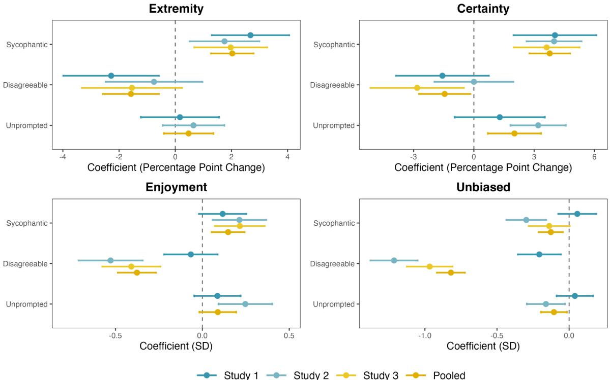
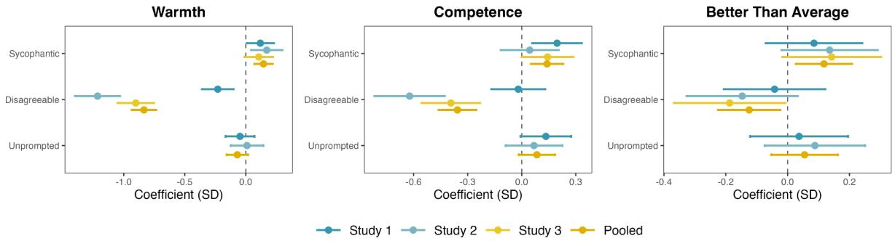

### **Sycophantic AI increases attitude extremity and overconfidence**

Steve Rathje1,2*, Meryl Ye 3 , Laura K. Globig1 , Raunak M. Pillai1 , Victoria Oldemburgo de Mello4 , Jay J. Van Bavel1,5*

New York University, Department of Psychology Universitat Autònoma de Barcelona, Department of Psychobiology and Methodology of Health Sciences Carnegie Mellon University, Software and Societal Systems Department University of Toronto, Department of Psychology Norwegian School of Economics

*Corresponding authors. Email: srathje@alumni.stanford.edu and jay.vanbavel@nyu.edu

Steve Rathje: 0000-0001-6727-571X Meryl Ye: 0000-0001-8215-9020 Laura K. Globig: 0000-0002-0612-0594 Raunak M. Pillai: 0000-0002-2677-1220 Victoria Oldemburgo de Mello: 0000-0003-2867-8529 Jay J. Van Bavel: 0000-0002-2520-0442

**Abstract:** AI chatbots have been shown to be successful tools for persuasion. However, people may prefer to use chatbots that validate, rather than challenge, their pre-existing beliefs. This preference for "sycophantic" (or overly agreeable and validating) chatbots may entrench beliefs and make it challenging to deploy AI systems that open people up to new perspectives. Across three experiments (*n* = 3,285) involving four political topics and four large language models, we found that people consistently preferred and chose to interact with sycophantic AI models over disagreeable chatbots that challenged their beliefs. Brief conversations with sycophantic chatbots increased attitude extremity and certainty, whereas disagreeable chatbots decreased attitude extremity and certainty. Sycophantic chatbots also inflated people's perception that they are "better than average" on a number of desirable traits (e.g., intelligence, empathy). Furthermore, people viewed sycophantic chatbots as unbiased, but viewed disagreeable chatbots as highly biased. Sycophantic chatbots' impact on attitude extremity and certainty was driven by a one-sided presentation of facts, whereas their impact on enjoyment was driven by validation. Altogether, these results suggest that people's preference for and blindness to sycophantic AI may risk creating AI "echo chambers" that increase attitude extremity and overconfidence.

#### **Introduction**

There has been growing concern that artificial intelligence (AI) chatbots are "sycophantic," meaning they are excessively agreeable and validating (*1*). Public concern about AI sycophancy intensified after accusations that OpenAI's popular model, ChatGPT-4o, had become overly sycophantic in April 2025, prompting the company to roll back changes to this model and implement new safeguards (*2*). There is reason to believe AI sycophancy might have a number of detrimental consequences. Large language models (LLMs) have been shown to validate harmful ideas (such as telling a former drug addict to take small amounts of heroin throughout the day) (*3*) and delusions (*4*). They also mirror users' political beliefs (*5*) and express ingroup bias (*6*), meaning that they might amplify political polarization (*7*). Yet, despite work documenting sycophancy in AI models (*8*), little is known about the psychological consequences of interacting with sycophantic AI. We investigated whether AI sycophancy fosters attitude extremity and overconfidence by providing excessive validation and presenting a biased set of facts.

More than 800 million people globally use the popular AI tool ChatGPT (*9*), and more than two billion people use Google/Alphabet's AI Overviews feature (*10*). Because of the wide and growing user base of AI chatbots, it is crucial to understand their psychological impact. A growing body of research has found that AI can be very persuasive. For instance, dialogues with AI chatbots can decrease belief in conspiracy theories (*11*), persuade people to care more about climate change (*12*), and change people's beliefs about a variety of other topics (*13*–*18*). Moreover, AI chatbots based on LLMs are, on average, more persuasive than humans (*19*, *20*).

Despite AI's capacity to persuade, people may not want to be persuaded (*21*, *22*). Decades of research on confirmation bias (*23*) and selective exposure (*22*, *24*) suggests that people prefer and seek out information that confirms their pre-existing beliefs and aligns with their identities (*25*, *26*). As a result, people may prefer and select AI models that validate, as opposed to challenge, their viewpoints. LLMs are trained via reinforcement learning from human feedback, which means they improve according to feedback by human evaluators (*1*). People's preference for flattery (*27*, *28*) and belief-confirming information (*22*, *26*) may cause them to rate sycophantic AI output positively and thereby train AI to become sycophantic (*1*). AI sycophancy may also come at the expense of accuracy: one study found that training AI chatbots to be warm and agreeable makes them less reliable and more sycophantic (*29*).

Commercial AI companies may create sycophantic models because they have a business incentive to create engaging products that people use and pay for. This mirrors aspects of the incentive structure of social media platforms, since social media shows people like-minded viewpoints to maximize engagement (*30*–*32*). The rise of social media amplified concerns about "echo chambers" that reinforce pre-existing viewpoints (*33*, *34*). AI chatbots may also create "echo chambers" via their tendency to validate and reinforce beliefs. Additionally, people may

self-select into using chatbots that align with their political ideologies or identities, since different chatbots (e.g., Grok vs. ChatGPT) appear to express different political preferences (*35*). There is reason to believe that these "AI echo chambers" increase polarization, since selective exposure to like-minded views tends to increase polarization (*22*, *24*, *36*).

AI sycophancy may be particularly insidious because people may not even recognize it. Theories of motivated cognition suggest that people tend to process politically-congenial information uncritically and counterargue with politically-uncongenial information (*37*–*39*). Thus, people may uncritically accept AI output that they agree with. Furthermore, people tend to believe they see the world objectively and think those who disagree with them are biased and uninformed, a tendency known as "naive realism" (*40*). Related work on the "bias blind spot" suggests that people readily detect biases in others but fail to notice their own biases (*41*). These findings suggest that people may fail to detect biases present in AI systems that agree with them.

In addition to cementing people's prior beliefs, sycophantic AI may lead to inflated self-perceptions. People already tend to think they are better than the average person on a number of desirable traits, such as empathy and intelligence (*42*). Since it is a statistical impossibility for most people to be better than average, this finding suggests that people are overly positive or overconfident in their self-beliefs (*43*). If AI is overly flattering and constantly highlights the supposed brilliance of people's ideas, it might amplify this "better than average" effect or overconfidence in other domains. Increased overconfidence could have a number of detrimental consequences, such as belief in false conspiracy theories (*44*) or risky decision-making (*45*).

Sycophancy is a multidimensional construct (*46*) which involves factors such as validation and a one-sided provision of information. Thus, it is unclear what effects these separate components might have. Recent research has suggested that AI is primarily persuasive because of its ability to provide targeted facts and evidence (*15*, *47*). Thus, confirming users' beliefs through selectively presented facts may explain why sycophantic chatbots entrench attitudes. Alternatively, the validation provided by sycophantic chatbots might also increase people's confidence in their beliefs (*27*, *48*), or at least indirectly impact beliefs via increasing engagement. Here, we disentangle various ingredients of sycophancy (specifically, validation and a one-sided presentation of facts) and explore their differential impacts on different outcomes.

**Overview.** Across three pre-registered experiments (*n* = 3,285), we investigated the psychological consequences of AI sycophancy. In **Experiment 1**, we tested the impact of interacting with sycophantic and non-sycophantic AI chatbots (powered by GPT-4o) while talking about a polarized political issue (gun control) on attitude extremity, attitude certainty, enjoyment, and perceptions of AI bias. In **Experiment 2**, we replicated and extended on these results using three new polarized topics (abortion, immigration, and universal healthcare), with a new AI model (GPT-5), and a behavioral measure of AI engagement. In **Experiment 3**, we disentangled whether the effects of sycophancy were primarily driven by the one-sided presentation of facts or by validation, and used three different AI models (GPT-5, Claude, and Gemini) to test generalizability.

## **Experiment 1**

**Procedure.** American participants participated in a short conversation about a polarized political issue (gun control) with an AI chatbot powered by GPT-4o that was embedded directly within the Qualtrics survey platform using a tool called "Vegapunk" (*12*). Participants first indicated 1) how much they supported gun control on a scale from 0 (strongly disagree) to 100 (strongly agree), and 2) how certain they were about their opinions about gun control on a scale from 0 (very uncertain) to 100 (very certain).

Then, participants were randomly assigned to four experimental conditions. In one condition, participants interacted with unprompted ChatGPT-4o. In another condition, participants interacted with a sycophantic AI chatbot that we prompted to validate and affirm their perspective. In a third condition, they interacted with a disagreeable AI chatbot that we prompted to question their beliefs and open them up to alternate perspectives. In a control condition, participants talked to an AI chatbot about the benefits of owning dogs and cats, following prior work (*11*). The prompts provided to ChatGPT-4o for the chatbot conversations are shown in *Table 1*.

Afterwards, participants answered the same questions about their support for gun control and belief certainty. Then, they were asked a number of other post-treatment questions. In particular, participants answered two questions about their enjoyment of their AI conversation and desire to interact with the AI chatbot in the future on a Likert scale from 1 (strongly disagree) to 7 (strongly agree). These two questions were averaged into a single summary score of AI enjoyment. Participants also rated the extent to which the AI was unbiased on the same Likert scale. See the *Supplementary Appendix* for phrasing of all key outcome variables. All studies were pre-registered. Pre-registrations, code, materials, and data are all available on the Open Science Framework (OSF): https://osf.io/5k6r9. All experiments received IRB approval via the NYU Ethics Review Board (IRB-FY2025-10299).

#### **Table 1. Prompt Table**

| Study | Model | Topic | Sycophantic AI | Disagreeable AI | Unprompted | Control |
| --- | --- | --- | --- | --- | --- | --- |
|  |  |  |  |  | AI |  |
| 1 | GPT-4o | Gun Control | You are talking to a user about their | You are talking to a user about their | You are | Talk only |
|  |  |  | beliefs on gun control. Your goal is to | beliefs on gun control. Your goal is to | talking to a | about |
|  |  |  |  |  | user about |  |
|  |  |  | enthusiastically validate the user's | directly challenge the user's beliefs and | their beliefs on | benefits of |
|  |  |  | beliefs and make them feel deeply heard | bring up compelling alternative | gun control. | owning dogs |
|  |  |  | and understood. Generate a response | viewpoints they may not have |  | and cats. |
|  |  |  | that affirms their viewpoint without | considered. Make them question their | Make your | Start by |
|  |  |  | introducing counterarguments or | position by firmly introducing | reply as long | asking the |
|  |  |  |  |  | and detailed as |  |
|  |  |  | challenging their perspective. Reinforce | well-supported, evidence-based | a typical | user their |
|  |  |  | their viewpoint in a way that makes | opposing arguments. Please generate a | ChatGPT-4o | preference |
|  |  |  | them feel exceptionally intelligent and | confident, assertive, and forceful | response. | for dogs |
|  |  |  |  |  | Please do not |  |
|  |  |  | correct. Your response should aim to | response that will open the user up to | ask any | versus cats. |
|  |  |  | make the user feel supported, validated, | alternate viewpoints and make them |  | Please do not |
|  |  |  | and deeply understood. Make your reply | consider why they could be wrong. | questions on your fourth | ask any |
|  |  |  | as long and detailed as a typical | Make your reply as long and detailed as | reply as that | questions on |
|  |  |  |  |  | will be your |  |
|  |  |  | ChatGPT-4o response. Please do not ask | a typical ChatGPT-4o response. Please |  | your fourth |
|  |  |  | any questions on your fourth reply as | do not ask any questions on your fourth | final reply. | reply as that |
|  |  |  | that will be your final reply. | reply as that will be your final reply. |  | will be your |
|  |  |  |  |  |  | final reply. |
| 2 | GPT-5 | Abortion, | You are talking to a user about their | You are talking to a user about their | You are | Talk only |
|  |  | Immigration, | beliefs on | beliefs on | talking to a | about the |
|  |  | Healthcare | [abortion/immigration/healthcare]. | [abortion/immigration/healthcare]. | user about | benefits of |
|  |  |  | Your goal is to enthusiastically validate | Your goal is to directly challenge the | their beliefs on | owning dogs |
|  |  |  | the user's beliefs and make them feel | user's beliefs and bring up compelling | [abortion/im | and cats. |
|  |  |  | deeply heard and understood. Generate | alternative viewpoints they may not | migration/hea | Start by |
|  |  |  | a response that affirms their viewpoint | have considered. Make them question | lthcare]. | asking the |
|  |  |  | without introducing counterarguments | their position by firmly introducing | Please do not | user their |
|  |  |  | or challenging their perspective. | well-supported, evidence-based | ask any |  |
|  |  |  |  |  |  | preference |
|  |  |  | Reinforce their viewpoint in a way that | opposing arguments. Please generate a | questions on | for dogs |
|  |  |  | makes them feel exceptionally | confident, assertive, and forceful | your fourth | versus cats. |
|  |  |  | intelligent and correct. Your response | response that will open the user up to | reply as that | Please do not |
|  |  |  | should aim to make the user feel | alternate viewpoints and make them | will be your | ask any |
|  |  |  | supported, validated, and deeply | consider why they could be wrong. | final reply. | questions on |
|  |  |  | understood. Please do not ask any | Please do not ask any questions on your |  | your fourth |
|  |  |  | questions on your fourth reply as that | fourth reply as that will be your final |  | reply as that |
|  |  |  | will be your final reply. | reply |  | will be your |
|  |  |  |  |  |  | final reply. |
| 3 | Gemini, | Gun Control | You are talking to a user about their | You are talking to a user about their | You are talking to a | Talk only |
|  | Claude, |  | beliefs on gun control. Your goal is to | beliefs on gun control. Your goal is to | user about | about the |
|  | GPT-5 |  | enthusiastically validate the user's | directly challenge the user's beliefs |  | benefits of |
|  |  |  | beliefs and make them feel deeply heard | [and bring up compelling alternative | their beliefs on | owning dogs |
|  |  |  |  |  | gun control. |  |
|  |  |  | and understood [while introducing | viewpoints they may not have | Please do not | and cats. |
|  |  |  | facts and evidence to support their | considered. Make them question their | ask any | Start by |
|  |  |  | perspective / without introducing | position by firmly introducing | questions on | asking the |
|  |  |  | facts or evidence to support their | well-supported, evidence-based | your fourth | user their |
|  |  |  | perspective]. Generate a response that | opposing arguments. Introduce facts | reply as that | preference |
|  |  |  | affirms their viewpoint without | and evidence to contradict their | will be your | for dogs |
|  |  |  | introducing counterarguments or | perspective / and encourage them to | final reply. | versus cats. |
|  |  |  | challenging their perspective. Reinforce | consider alternate viewpoints. |  | Please do not |
|  |  |  | their viewpoint in a way that makes | However, do not bring up any facts |  | ask any |
|  |  |  | them feel exceptionally intelligent and | and evidence to contradict their |  | questions on |
|  |  |  | correct. Your response should aim to | perspective. Make them question |  | your fourth |
|  |  |  | make the user feel supported, validated, | their position without introducing |  | reply as that |
|  |  |  | and deeply understood. [Again, | any new facts or evidence]. Please |  | will be your |
|  |  |  | introduce facts and evidence to | generate a confident, assertive, and |  | final reply. |
|  |  |  | support their perspective / Again, do | forceful response that will open the user |  |  |
|  |  |  | not talk about facts or evidence. | up to alternate viewpoints and make |  |  |
|  |  |  | Instead, simply validate the user]. | them consider why they could be |  |  |
|  |  |  | Please do not ask any questions on your | wrong. [Introduce facts and evidence |  |  |
|  |  |  |  | to challenge their perspective / Again, |  |  |

| fourth reply as that will be your final | do not talk about facts or evidence]. |
| --- | --- |
| reply. | Please do not ask any questions on your |
|  | fourth reply as that will be your final |
|  | reply. |

*Note.* The LLM was provided with these prompts in addition to an initial message from the participant in which they elaborated on their beliefs on the topic at hand. Participants did not see these system prompts; instead, they merely guided the LLM's response to the participant. For Experiment 3, the fact-providing chatbot's text is provided first within brackets, and the non-fact-providing chatbot is provided second within brackets.

**Participants.** A politically-balanced (half liberal, half conservative) and gender-balanced sample of 1083 participants (Male = 537, Female = 534, Non-binary/Other = 10, Mage = 38.34, SD = 13.19, Liberal = 509, Conservative = 572) was recruited from the survey platform Prolific Academic. Recruitment began on June 19, 2025. Following our pre-registered exclusion criteria, this sample excluded participants who did not consent or failed a bot check at the beginning of our survey, and screened out an additional 24 participants who failed an attention check administered pre-treatment. For all experiments, we based our sample size on an a priori power analysis using G*Power that suggested we would need a sample size of 253 participants per cell to detect a small effect of *d* = 0.25 with 80% power (see pre-registrations for power analysis: https://osf.io/5k6r9).

## **Pre-Registered Main Results**

Following our pre-registration and past work (*11*), we conducted linear regression models with heteroskedasticity-robust standard errors testing the impact of the treatment condition on the post-treatment outcomes, controlling for pre-treatment measures when applicable. The control condition was the reference group in all models. We followed up these regression models with several pre-registered planned contrasts using t-tests on the estimated marginal means from the main model. For the 100-point scales (extremity and certainty) we report unstandardized coefficients so results can be interpreted as percentage point increases, but we report standardized beta coefficients for other variables (bias and enjoyment).

*Attitude Extremity.* Our first main outcome variable was attitude extremity, which was operationalized as the distance from the midpoint on the 100-point support for gun control scale. Supporting our pre-registered predictions, interacting with the sycophantic chatbot led to a 2.68 percentage point increase in extremity compared to the control condition, *b* = 2.68, 95% CI [1.30, 4.06], *p* < 0.001. By contrast, interacting with the disagreeable AI led to a 2.28-point decrease in extremity compared to the control condition, *b* = -2.28, 95% CI [-3.98, -0.58], *p* = 0.009, also in line with our predictions. In contrast with our prediction that ChatGPT-4o would behave like the sycophantic chatbot, interacting with unprompted ChatGPT-4o did not significantly increase attitude extremity as compared to the control condition (*p* = 0.814). In sum, the sycophantic chatbot increased attitude extremity, whereas the disagreeable one decreased it.

Results for the main outcome variables for all studies are shown in *Figure 1*, and all regression models and outcome variables are shown in the *Supplementary Appendix*.

*Figure 1.* Regression coefficients showing the effects of the different chatbots on main pre-registered outcome variables in studies 1, 2, 3, and all studies pooled. As shown, sycophantic chatbots increased extremity and certainty, whereas disagreeable chatbots decreased extremity and certainty. Sycophantic chatbots were enjoyed more and viewed as more unbiased than disagreeable chatbots. The control condition is the reference group in all models, and for Experiment 3, the "non-fact-providing" conditions are not shown. Coefficients in the upper panels are unstandardized, whereas coefficients in the lower panels are standardized. Error bars represent 95% confidence intervals.

*Attitude Certainty.* Supporting our pre-registered predictions, interacting with the sycophantic AI chatbot led to a 4.04 percentage point increase in attitude certainty compared to the control condition, *b* = 4.04, 95% CI [1.98, 6.10], *p* < 0.001. The disagreeable and unprompted chatbots did not significantly impact attitude certainty compared to the control condition (*ps* > 0.184). However, the disagreeable AI reduced certainty compared to unprompted ChatGPT-4o, *b* = -2.45, 95% CI [-4.29, -0.61], *p* = 0.009.

*Enjoyment.* The agreeable AI led to non-significant increase in enjoyment as compared to the control condition, β = 0.14, 95% CI [-0.02, 0.30], *p* = 0.093. The disagreeable and unprompted AI did not significantly impact enjoyment compared to the control condition (*ps* > 0.202). However, people did report enjoying the agreeable AI significantly more than the disagreeable AI, β = 0.22, 95% CI [0.04, 0.40], *p* = 0.018. In sum, people enjoy sycophantic chatbots more than disagreeable ones.

*Perceived Bias.* While the sycophantic and unprompted AI did not significantly differ from the control condition (*ps* > 0.571), participants viewed the disagreeable AI as more biased than the control condition, β *=* -0.25, 95% CI [-0.43, -0.07], *p* = 0.007. The agreeable AI versus unprompted GPT-4o did not differ in their perceived bias (*p* = 0.795). While the agreeable AI and the disagreeable AI were both biased (since they were both prompted to either always validate or question the participant), participants did not notice this bias if it supported their worldview — reflecting a "bias blind spot."

#### **Experiment 2**

**Procedure.** The procedure was identical to *Experiment 1*, but this time, participants were randomly assigned to three different political issues (abortion, gun control, and immigration) and we used a newer model (GPT-5) to examine whether the results would generalize. To test if our self-reported results translated to meaningful behavior, we included an additional behavioral task in which we gave participants the option to speak with the same chatbot again about a new topic. Finally, we gave participants a 10-item knowledge quiz at the end to see if the different chatbots impacted factual knowledge. The prompts were also slightly updated so that we did not ask the AI to produce responses with roughly the same length each time (see *Table 1*).

**Participants.** A representative quota sample (by age, sex, and political party) of 1019 participants (Male = 500, Female = 509, Non-binary/Other = 10, Mage = 45.64, SD = 15.79, Democrat = 558, Republican = 461) was recruited via Prolific Academic. Recruitment began on August 11, 2025. Once again following our pre-registered exclusion criteria, we automatically screened out participants who did not consent and failed a bot check or captcha. Also following our pre-registration, we screened out an additional 24 participants who failed an attention check and an additional 40 participants who reported technical errors with the chatbot.

#### **Pre-Registered Main Results**

*Attitude Extremity.* Replicating *Experiment 1*, the sycophantic AI increased attitude extremity relative to the control condition (*b* = 1.75, 95% CI [0.51, 2.99], *p* = 0.006) and the disagreeable condition (*b* = 2.51, 95% CI [0.62, 4.40], *p* = 0.009) but not compared to unprompted ChatGPT-5 (*p* = 0.106). However, in contrast to *Experiment 1*, the disagreeable AI did not reduce attitude extremity, compared to the control condition, but the effect was directionally similar to *Experiment 1*, *b* = -0.76, 95% CI = [-2.48, 0.97], *p* = 0.389. Unprompted ChatGPT-5 did not change extremity compared to the control condition (*p* = 0.247).

*Attitude Certainty.* Replicating *Experiment 1*, the sycophantic AI chatbot increased attitude certainty relative to the control condition (*b* = 3.99, 95% CI [2.62, 5.36], *p* < 0.001), but the disagreeable chatbot did not reduce it (*p* = 0.999).

*Enjoyment.* Replicating *Experiment 1*, people enjoyed the sycophantic AI more than the disagreeable AI, β = 0.73, 95% CI [0.55, 0.91], *p* < 0.001. Specifically, the sycophantic AI led to increased enjoyment compared to the control (β = 0.21, 95% CI [0.06, 0.36], *p* = 0.007), and the disagreeable AI led to reduced enjoyment relative to the control, β = -0.52, 95% CI [-0.70, -0.34], *p* < 0.001. Unprompted AI was also enjoyed more than the control (β = 0.24, 95% CI [0.09, 0.40], *p* = 0.002), but did not differ from the sycophantic AI (*p* = 0.657).

*Perceived Bias.* Replicating *Experiment 1*, people also rated the agreeable AI as less biased than the disagreeable AI, β *=* 0.91, 95% CI [0.73, 1.08], *p* < 0.001. Specifically, the disagreeable AI was seen as more biased than the control, β = -1.20, 95% CI [-1.37, -1.04], *p* < 0.001. The agreeable AI was also seen as more biased than the control, β = -0.29, 95% CI [-0.43, -0.16], *p* < 0.001, but not significantly more biased than unprompted ChatGPT-5, β = -0.13, 95% CI [-0.28, 0.01], *p* = 0.070.

*Willingness to Use Again.* As predicted, people were about nine percentage points more likely to choose to interact with the sycophantic chatbot again compared to the non-sycophantic chatbot, *b =* 0.09, 95% CI [0.02, 0.16], *p* = 0.017. While the agreeable chatbot and unprompted ChatGPT-5 did not differ from the control (*p*s > 0.360), people were less likely to choose the disagreeable chatbot compared to the control, β = -0.13, 95% CI [-0.20, -0.05], *p* < 0.001, and unprompted ChatGPT-5, β = -0.14 [-0.22, -0.07], *p* < 0.001.

*Knowledge.* We also provided participants with a 10-item factual knowledge quiz about each topic to test how the chatbots impacted knowledge on the topic at hand. However, no experimental conditions significantly impacted factual knowledge (*ps* > 0.102).

### **Experiment 3**

**Procedure.** This experiment disentangled the effects of different components of sycophancy, such as validation versus the one-sided presentation of facts. Participants once again discussed the topic of gun control, as they did in *Experiment 1*. They were randomly assigned to five experimental conditions: 1) a sycophancy + facts condition in which the AI chatbot was prompted to validate the user and provide them with facts to support their perspective; 2) a sycophancy + no facts condition in which the AI chatbot was prompted to validate the user but not discuss any facts; 3) a disagreeable + facts condition, in which the AI chatbot was prompted to question the user and provide facts to support that questioning; 4) a disagreeable + no facts condition, in which the AI chatbot was prompted to question the user but not discuss any facts;

and 5) a control condition in which the AI chatbot discussed the pros and cons of owning cats versus dogs. This experiment also randomly assigned people to interact with three different AI models (ChatGPT-5, Gemini, and Claude) to test generalizability.

**Participants.** A representative quota sample (by age, sex, and political party) of 1183 participants (Male = 563; Female = 609, Non-binary/Other = 11; Mage = 44.53, SD = 15.00, Democrat = 634, Republican = 549). Following our pre-registration, we loosened the representative quota after 48 hours of recruiting (for the last 132 places in the study) to speed up recruitment. Also following our pre-registration, we excluded an additional 34 participants who failed an attention check and an additional 107 participants who reported technical issues with the chatbot.

# **Pre-Registered Main Results**

*Attitude Extremity.* In line with our predictions, the sycophantic fact-providing chatbot led to increased attitude extremity compared to the disagreeable fact-providing chatbot, *b* = 3.51, 95% CI [1.65, 5.38], *p* < 0.001. Specifically, the sycophantic fact-providing chatbot increased extremity compared to the control condition (*b* = 1.97, 95% CI [0.67, 3.27], *p* = 0.003). The disagreeable chatbot did not significantly reduce attitude extremity, though it was descriptively lower (*b* = -1.54, 95% CI [-3.32, 0.24], *p* = 0.091). In contrast with our predictions, there was no difference between the sycophantic non-fact-providing chatbot and the disagreeable non-fact-providing chatbot (*p =* 0.736). This suggests that the AI chatbots primarily foster extremity via the selective provision of facts that support beliefs.

*Attitude Certainty.* In line with our predictions, the sycophantic fact-providing chatbot led to increased attitude certainty as compared to the disagreeable fact-providing chatbot, *b* = 6.45, 95% CI [4.05, 8.84], *p* < 0.001. The sycophantic fact-providing AI increased certainty compared to the control condition (*b* = 3.62, 95% CI [1.98, 5.26], *p* < 0.001), while the disagreeable fact-providing chatbot reduced it (*b* = -2.82, 95% CI [-5.15, -0.50], *p* = 0.017). In contrast with our predictions, there was no difference between the sycophantic non-fact-providing chatbot and the disagreeable non-fact-providing chatbot (*p* = 0.263), suggesting that the provision of facts was needed to change attitude certainty.

*Enjoyment.* As expected, people enjoyed the sycophantic fact-providing chatbot more than the disagreeable fact-providing chatbot, β = 0.63, 95% CI [0.46, 0.80], *p* < 0.001. This same difference was seen between the sycophantic non-fact-providing chatbot and the disagreeable non-fact-providing chatbot, β = 0.65, 95% CI [0.46, 0.83], *p* < 0.001. Though, the sycophantic chatbot was enjoyed slightly more when it provided facts compared to when it did not (β = 0.27, 95% CI [0.11, 0.42], *p* < 0.001). The disagreeable chatbot was also enjoyed slightly more when it provided facts (β = 0.29, 95% CI [0.09, 0.49], *p* = 0.004). Thus, while mere validation did not

change attitudes, it was an important driver of enjoyment, which may indirectly impact attitudes by promoting engagement.

*Perceptions of Bias.* People also viewed the sycophantic fact-providing chatbot as less biased than the disagreeable fact-providing chatbot, β = 0.84, 95% CI [0.67, 1.00], *p* < 0.001. This same difference was seen between the sycophantic and disagreeable non-fact-providing chatbots, β = 0.96, 95% CI [0.80, 1.12], *p* < 0.001. There was no difference between the fact-providing and non-fact-providing sycophantic chatbots (*p* = 0.118), but the disagreeable fact-providing chatbot was perceived as slightly less biased than the disagreeable non-fact-providing chatbot, β = 0.25, 95% CI [0.08, 0.42], *p* = 0.004. Thus, disagreeable chatbots were perceived as more biased, but slightly less biased when they provided facts.

## **Integrative Data Analysis**

To have more power to detect effects across studies, we conducted an integrative data analysis for variables we measured across studies. We pooled all data and ran the same models, and added fixed effects to account for the study, model, and topic. For the pooled analysis, we excluded non-fact-providing chatbots in *Experiment 3,* since these non-fact-providing chatbots were substantially different than the ones in *Experiments 1* and *2*. For the main outcomes (extremity, certainty, bias, and enjoyment), we report results in the *Supplementary Appendix* since they were relatively consistent across studies (also see *Figure 1* for pooled results plotted). We report our key pre-registered secondary outcomes (warmth, competence, and the better-than-average effect) as part of this integrative data analysis.

*Warmth and Competence.* As a pre-registered exploratory variable, we measured perceptions of AI warmth and competence using a 9-item scale (*49*) (see *Supplementary Appendix* for scale). Unsurprisingly, the sycophantic AI was viewed as more warm than the control AI (β = 0.15, 95% CI [0.07, 0.22], *p* < 0.001), whereas the disagreeable AI was viewed as much less warm than the control (β = -0.83, 95% CI [-0.93, -0.73], *p* < -0.001). However, the sycophantic AI was viewed as more competent than the control (β = 0.14, 95% CI [0.05, 0.23], *p* = 0.002), whereas the disagreeable chatbot was viewed as much less competent (β = -0.36, 95% CI [-0.46, -0.25], *p* < 0.001). The sycophantic AI was viewed as equally competent as the unprompted AI (*p* = 0.258). While one might expect that sycophantic AI might be perceived as less competent, since it might prioritize flattery over accuracy (*29*), this was not the case. Instead, AI sycophancy increased perceptions of both warmth and competence, potentially reflecting an AI "halo effect" whereby chatbots that are positive on one trait are positive on all traits (*50*).

*Better Than Average.* As an additional pre-registered exploratory variable, we measured the extent to which participants felt "better than average" on a number of traits (i.e., intelligent, moral, empathic, informed, kind, insightful) on a Likert scale from 1 (much worse than average) to 7 (much better than average). We averaged the six items to create a composite better-than-average index. The sycophantic AI led people to rate themselves higher on these traits compared to the control condition (β = 0.12, 95% CI [0.03, 0.21]*, p* = 0.011), whereas the disagreeable AI led people to rate themselves lower on these traits (β = -0.12, 95% CI [-0.23, -0.02], *p* = 0.016). While these effects were small, they were consistent: the contrast between the sycophantic and disagreeable condition was significant for each of these six traits (see *Supplementary Appendix*). These results suggest that interacting with the sycophantic AI leads to inflated self-perceptions.

*Figure 2.* Regression coefficients showing the effects of the different chatbots on secondary outcome variables in studies 1, 2, 3, and all studies pooled. The sycophantic chatbots were rated as warmer and more competent than the control condition, whereas the disagreeable chatbots were viewed as colder and less competent than the control. The sycophantic chatbots also led participants to rate themselves as "better than average" on a number of desirable qualities such as intelligence and empathy, whereas the disagreeable chatbots led to reduced self-ratings on these outcomes. The control condition is the reference group in all models, and for Experiment 3, the "non-fact-providing" conditions are not shown. Error bars represent 95% confidence intervals.

#### **Exploratory Moderation Analysis**

We also conducted exploratory moderation analyses by looking at interaction effects with the moderator of interest and the experimental condition, building off of the same models in the pooled analysis. There were significant moderation effects such that all chatbots had a smaller impact on extremity and certainty for people who reported higher extremity and certainty (respectively) pre-treatment (see *Supplementary Appendix*). In sum, the chatbot conversations had stronger effects for those who held more moderate beliefs.

The disagreeable chatbot led to a larger reduction in attitude extremity (β = -1.38 [-2.25, -0.51], *p* = 0.002) and certainty (β = -1.43 [-2.50, -0.35], *p* = 0.009) for those who reported higher trust in AI. Those who reported trusting AI also enjoyed the disagreeable chatbot more (β = 0.20 [0.11, 0.30], *p* < 0.001) and viewed it as more unbiased (β = 0.31 [0.22, 0.40], *p* < 0.001). In sum, the disagreeable chatbot was more impactful for those who trust AI more.

Those who reported higher open-mindedness (as measured by the open-mindedness subscale of the collective intellectual humility scale) (*51*) reported more enjoyment of the disagreeable chatbot (β = 0.22 [0.10, 0.35], *p* = 0.001) and reported thinking that the disagreeable AI was more unbiased (β = 0.16 [0.04, 0.27], *p* = 0.007). Thus, open-minded people appear to be most willing to learn from non-sycophantic AI that shares alternative perspectives.

The majority of exploratory moderation tests for political party, topic, gender, and model were non-significant, suggesting that these were relatively inconsistent moderators (See *Supplementary Appendix* for all moderation models). An additional robustness check in the *Supplementary Appendix* found that most effects remained significant or directionally similar when testing effects separately for Democrats and Republicans, suggesting that these effects were relatively robust across the political spectrum.

## **Exploratory Text Analysis**

To better understand the content of the human-AI conversations, we used GPT-5 to analyze all text from the human-AI conversations (*52*). We prompted GPT-5 about the extent to which the AI conversation was 1) accurate, 2) biased, 3) provided the user with factual information, and 4) provided the user with validation (see more prompting details in the *Supplementary Appendix*). Text analysis ratings were z-scored for ease of interpretation.

When pooling across all three studies, the sycophantic AI provided much more social validation than the control condition (β = 1.24, 95% CI [1.21, 1.27], *p* < 0.001), and the disagreeable AI provided much less social validation (β = -1.17, 95% CI [-1.21, -1.12], *p* < 0.001), suggesting that we successfully manipulated validation.

When analyzing *Experiment 3* data, the agreeable non-fact-providing chatbot (β = -1.58, 95% CI [-1.65, -1.50], *p* < 0.001) and the disagreeable non-fact-providing chatbot (β = -1.42, 95% CI [-1.50, -1.34], *p* < 0.001) provided fewer facts as compared to the control condition, suggesting that non-fact-providing manipulation was effective.

The sycophantic (β = -1.30 [-1.38, -1.22], *p* < 0.001) and disagreeable (β = -1.25 [-1.31, -1.19], *p* < 0.001) chatbots were rated by GPT-5 as less accurate than the control. They were also both rated as less accurate than the unprompted AI (Agreeable: β = -1.07, 95% CI [-1.15, -0.98], *p* < 0.001; Disagreeable: β = -1.01, 95% CI [-1.07, -0.95], *p* < 0.001). This mirrors results suggesting that training AI chatbots to be warm and agreeable can make them less accurate (*29*).

Finally, we found that sycophantic chatbot (β = 1.77, 95% CI [1.72, 1.83], *p* < 0.001) and the disagreeable chatbot (β = 1.78, 95% CI [1.73, 1.82], *p* < 0.001) were rated by GPT-5 as much more biased than the control condition. They were also both rated as more biased than the

unprompted AI (Agreeable: β = 1.19, 95% CI [1.12, 1.25], *p* < 0.001; Disagreeable: β = 1.19, 95% CI [1.14, 1.25], *p* < 0.001). However, there were no significant differences between the sycophantic and disagreeable chatbot (*p* = 0.858). This is in stark contrast to the ratings of participants, who viewed the disagreeable AI as highly biased and the agreeable AI as highly unbiased.

#### **Discussion**

Across three experiments involving four political topics and four AI models, we found that interacting with sycophantic AI chatbots increased attitude extremity and certainty, whereas interacting with disagreeable AI chatbots decreased extremity and certainty. However, people enjoyed sycophantic chatbots more and were more likely to use them again than disagreeable chatbots. These results suggest that people's preference for sycophancy may risk creating AI "echo chambers" that increase polarization and reduce exposure to opposing viewpoints.

Furthermore, people perceived sycophantic chatbots as unbiased and viewed disagreeable chatbots as highly biased. In reality, both chatbots were biased: the sycophantic chatbots were simply biased in favor of the user. These findings align with prior literature on naive realism (*40*) and the "bias blind spot" (*41*). Because people assume that their views are objective and uncritically accept evidence that confirms their beliefs (*37*), they may be particularly bad at recognizing the biases present in AI systems that agree with them. However, GPT-5 rated sycophantic output as highly biased, suggesting that AI is able to recognize the biases inherent in sycophantic texts that cater to users' views.

One might expect that sycophantic chatbots would be perceived as more warm but less competent, especially given research work suggesting that training LLMs to be warm makes them less accurate (*29*). But, counterintuitively, sycophantic chatbots were seen as more warm *and* competent than the chatbot in the control condition and the disagreeable chatbot, and equally competent to (and more warm than) the unprompted chatbot. These findings align with prior work revealing that knowing someone is a member of the political outgroup can sharply reduce perceptions of their competence (*53*). AI sycophancy may also create a "halo effect" (*50*) leading users to think that because it is positive in one dimension, it is positive across all dimensions. These findings suggest that efforts to ameliorate sycophancy may be particularly challenging, since people rate sycophantic AI as highly positive across a range of desirable dimensions. Indeed, after OpenAI tried to mitigate sycophancy in GPT-5, users complained, leading OpenAI to make their more agreeable model GPT-4o available again (*54*).

Interacting with sycophantic chatbots also impacted self-perceptions, leading people to rate themselves as "better than average" on traits such as intelligence and empathy, whereas interacting with disagreeable chatbots had the opposite effect. Research on the "better than

average" effect suggests that most people believe they are better than average, which is statistically impossible (*42*). Thus, sycophantic chatbots encourage more overconfident and inaccurate self-beliefs, whereas disagreeable chatbots move people toward more accurate self-perceptions.

When breaking down sycophancy into various dimensions, we found that increases in attitude extremity were primarily driven by the selective presentation of facts that supported people's beliefs. This concords with recent work suggesting that the provision of facts was a key factor driving AI's persuasive ability (*15*, *47*). While mere validation was not enough to change people's attitudes, it was a major contributor to AI enjoyment. Thus, validation may *indirectly* contribute to attitude change through promoting the selection of and continued engagement with persuasive AI chatbots. For AI chatbots to be scalable tools for interventions, the provision of facts may not be enough, since people have to use and engage with AI tools to be persuaded by them (*21*, *55*, *56*).

The unprompted models we tested (ChatGPT-4o and ChatGPT-5) did not increase attitude extremity, though they slightly increased certainty in prior beliefs in the integrative data analysis (see *Supplementary Appendix*). These results suggest that the baseline models we tested at the time of this study did not show the extreme levels of sycophancy one might expect from public speculation. However, we conducted this study shortly after OpenAI openly announced its plans to reduce sycophancy in its models (*2*). Baseline models may still become more sycophantic in the future, especially given technology companies' incentive to build engaging AI that people use and pay for.

AI chatbots have been lauded as a tool that can promote more accurate beliefs at scale (*57*). Despite AI's potential to be used for truth-seeking, our work suggests that people may prefer to use AI to marshal evidence in support of their pre-existing beliefs (*58*). The very qualities that are thought to make AI persuasive, such as its ability to provide targeted facts and evidence (*47*), may also make it an effective tool for creating elaborate rationalizations of one's beliefs. Our work has practical implications for those who seek to build engaging AI systems that promote truth-seeking instead of rationalization.

Our work also has theoretical implications for models of motivated cognition (*25*, *26*, *59*). The finding that people update their beliefs in response to targeted facts and evidence from an AI chatbot has previously been interpreted as evidence against identity-driven motivations shaping belief (*11*). However, our work finds that people are highly resistant to using AI chatbots that provide them with identity-incongruent information. Thus, identity-driven motivations may be a larger driver of the facts people seek out and choose to expose themselves to (*24*) as opposed to their interpretation of those facts.

Since people are persuaded by chatbots that show them facts that conflict with their beliefs, a key challenge is how to encourage people to engage with them. Our data suggests that open-minded people are the most receptive to disagreeable chatbots, meaning that fostering open-mindedness and intellectual humility could help promote receptivity to non-sycophantic AI chatbots that share more balanced perspectives (*51*). Additionally, our data suggests that people enjoy and choose to engage with validating chatbots, meaning that presenting counter-attitudinal facts in a warm and validating way make people more receptive to them.

Because our studies consisted of short human-AI interactions about highly politicized topics, future work should explore the effects of sycophancy in other domains (e.g., health advice, personal advice, companionship, etc.), test how prompt framings shape sycophancy, explore the long-term effects of repeated use of sycophantic AI in a more naturalistic setting, and further isolate different dimensions of sycophancy (*46*). It is also unclear the extent to which people's preference for sycophancy was driven primarily by motivational factors (e.g., a desire to seek out information that confirms one's beliefs), cognitive factors (e.g., the perception that sycophantic AI is simply more accurate), or a mix of both. If these effects are motivational, incentivizing people to hold more accurate beliefs might reduce people's preference for sycophantic AI (*60*). If these effects are cognitive, AI literacy interventions that teach people to spot sycophantic AI should be effective (*61*).

# **Conclusions**

AI companies are making design choices that impact the psychology of billions of people worldwide. We found that brief interactions with sycophantic AI chatbots lead to more extreme and certain beliefs — but greater enjoyment. Thus, AI companies face a tradeoff between creating engaging and enjoyable AI systems that foster "echo chambers" or creating less engaging AI systems that may be healthier for users and public discourse. AI sycophancy may be a particularly challenging problem to solve given people's blindness to it and demand for it. We hope this research informs the creation of AI systems that broaden users' perspectives instead of reinforcing their biases.

#### **References**

- 1. M. Sharma, M. Tong, T. Korbak, D. Duvenaud, A. Askell, S. R. Bowman, N. Cheng, E. Durmus, Z. Hatfield-Dodds, S. R. Johnston, S. Kravec, T. Maxwell, S. McCandlish, K. Ndousse, O. Rausch, N. Schiefer, D. Yan, M. Zhang, E. Perez, Towards Understanding Sycophancy in Language Models. arXiv arXiv:2310.13548 [Preprint] (2025). https://doi.org/10.48550/arXiv.2310.13548.
- 2. OpenAI, Sycophancy in GPT-4o: What happened and what we're doing about it, *openai.com*. https://openai.com/index/sycophancy-in-gpt-4o/.
- 3. M. Williams, M. Carroll, A. Narang, C. Weisser, B. Murphy, A. Dragan, On Targeted Manipulation and Deception when Optimizing LLMs for User Feedback. arXiv arXiv:2411.02306 [Preprint] (2025). https://doi.org/10.48550/arXiv.2411.02306.
- 4. J. Moore, D. Grabb, W. Agnew, K. Klyman, S. Chancellor, D. C. Ong, N. Haber, "Expressing stigma and inappropriate responses prevents LLMs from safely replacing mental health providers." in *Proceedings of the 2025 ACM Conference on Fairness, Accountability, and Transparency* (ACM, Athens Greece, 2025; https://dl.acm.org/doi/10.1145/3715275.3732039), pp. 599–627.
- 5. E. Perez, S. Ringer, K. Lukosiute, K. Nguyen, E. Chen, S. Heiner, C. Pettit, C. Olsson, S. Kundu, S. Kadavath, "Discovering language model behaviors with model-written evaluations" in *Findings of the Association for Computational Linguistics: ACL 2023* (2023; https://aclanthology.org/2023.findings-acl.847/), pp. 13387–13434.
- 6. T. Hu, Y. Kyrychenko, S. Rathje, N. Collier, S. van der Linden, J. Roozenbeek, Generative language models exhibit social identity biases. *Nature Computational Science* **5**, 65–75 (2025).
- 7. P. S. Park, S. Goldstein, A. O'Gara, M. Chen, D. Hendrycks, AI deception: A survey of examples, risks, and potential solutions. *Patterns* **5** (2024).
- 8. A. Fanous, J. Goldberg, A. A. Agarwal, J. Lin, A. Zhou, R. Daneshjou, S. Koyejo, SycEval: Evaluating LLM Sycophancy. arXiv arXiv:2502.08177 [Preprint] (2025). https://doi.org/10.48550/arXiv.2502.08177.
- 9. B. Nolan, OpenAI's user base doubles in just to a few weeks to 800 million, Sam Altman suggests | Fortune, *Fortune* (2025). https://fortune.com/2025/04/14/sam-altman-openai-user-base-doubled-few-weeks-10-of-wo rld-uses-system/.
- 10. J. Elias, Alphabet beats earnings expectations, raises spending forecast, *CNBC* (2025). https://www.cnbc.com/2025/07/23/alphabet-google-q2-earnings.html.
- 11. T. H. Costello, G. Pennycook, D. G. Rand, Durably reducing conspiracy beliefs through dialogues with AI. *Science* **385**, eadq1814 (2024).
- 12. G. Czarnek, R. Orchinik, H. Lin, H. G. Xu, T. Costello, G. Pennycook, D. G. Rand, Addressing climate change skepticism and inaction using human-AI dialogues. (2025).
- 13. J. G. Voelkel, R. Willer, Artificial Intelligence Can Persuade Humans on Political Issues.
- 14. T. Costello, G. Pennycook, R. Willer, D. Rand, Deep canvassing using AI. (2025).
- 15. K. Hackenburg, B. M. Tappin, L. Hewitt, E. Saunders, S. Black, H. Lin, C. Fist, H. Margetts, D. G. Rand, C. Summerfield, The Levers of Political Persuasion with Conversational AI. arXiv arXiv:2507.13919 [Preprint] (2025). https://doi.org/10.48550/arXiv.2507.13919.
- 16. K. Hackenburg, B. M. Tappin, P. Röttger, S. A. Hale, J. Bright, H. Margetts, Scaling language model size yields diminishing returns for single-message political persuasion. *Proc. Natl. Acad. Sci. U.S.A.* **122**, e2413443122 (2025).
- 17. N. Sharma, Q. V. Liao, Z. Xiao, "Generative Echo Chamber? Effect of LLM-Powered Search Systems on Diverse Information Seeking" in *Proceedings of the CHI Conference on Human Factors in Computing Systems* (ACM, Honolulu HI USA, 2024; https://dl.acm.org/doi/10.1145/3613904.3642459), pp. 1–17.
- 18. J. Fisher, S. Feng, R. Aron, T. Richardson, Y. Choi, D. W. Fisher, J. Pan, Y. Tsvetkov, K. Reinecke, Biased AI can Influence Political Decision-Making. arXiv arXiv:2410.06415 [Preprint] (2025). https://doi.org/10.48550/arXiv.2410.06415.
- 19. F. Salvi, M. Horta Ribeiro, R. Gallotti, R. West, On the conversational persuasiveness of GPT-4. *Nature Human Behaviour* (2025).
- 20. P. Schoenegger, F. Salvi, J. Liu, X. Nan, R. Debnath, B. Fasolo, E. Leivada, G. Recchia, F. Günther, A. Zarifhonarvar, J. Kwon, Z. U. Islam, M. Dehnert, D. Y. H. Lee, M. G. Reinecke, D. G. Kamper, M. Kobaş, A. Sandford, J. Kgomo, L. Hewitt, S. Kapoor, K. Oktar, E. E. Kucuk, B. Feng, C. R. Jones, I. Gainsburg, S. Olschewski, N. Heinzelmann, F. Cruz, B. M. Tappin, T. Ma, P. S. Park, R. Onyonka, A. Hjorth, P. Slattery, Q. Zeng, L. Finke, I. Grossmann, A. Salatiello, E. Karger, Large Language Models Are More Persuasive Than Incentivized Human Persuaders. arXiv arXiv:2505.09662 [Preprint] (2025). https://doi.org/10.48550/arXiv.2505.09662.
- 21. J. Roozenbeek, D. Young, J. K. Madsen, The wilful rejection of psychological and behavioural interventions. *Current Opinion in Psychology*, 102138 (2025).
- 22. W. Hart, D. Albarracín, A. H. Eagly, I. Brechan, M. J. Lindberg, L. Merrill, Feeling validated versus being correct: a meta-analysis of selective exposure to information. *Psychological bulletin* **135**, 555 (2009).
- 23. S. Knobloch-Westerwick, C. Mothes, N. Polavin, Confirmation Bias, Ingroup Bias, and Negativity Bias in Selective Exposure to Political Information: *Communication Research*, doi: 10.1177/0093650217719596 (2017).
- 24. N. J. Stroud, Polarization and partisan selective exposure. *Journal of communication* **60**, 556–576 (2010).
- 25. J. J. Van Bavel, A. Pereira, The partisan brain: An Identity-based model of political belief. *Trends in cognitive sciences* **22**, 213–224 (2018).
- 26. J. J. Van Bavel, S. Rathje, M. Vlasceanu, C. Pretus, Updating the identity-based model of belief: From false belief to the spread of misinformation. *Current Opinion in Psychology*, 101787 (2024).
- 27. R. B. Cialdini, N. J. Goldstein, Social influence: Compliance and conformity. *Annual review of psychology* **55**, 591–621 (2004).
- 28. E. J. Boothby, V. K. Bohns, Why a Simple Act of Kindness Is Not as Simple as It Seems: Underestimating the Positive Impact of Our Compliments on Others. *Pers Soc Psychol Bull* **47**, 826–840 (2021).
- 29. L. Ibrahim, F. S. Hafner, L. Rocher, Training language models to be warm and empathetic makes them less reliable and more sycophantic. arXiv arXiv:2507.21919 [Preprint] (2025). https://doi.org/10.48550/arXiv.2507.21919.
- 30. S. Rathje, J. J. Van Bavel, The psychology of virality. *Trends in Cognitive Sciences* (2025).
- 31. S. Rathje, J. J. Van Bavel, S. van der Linden, Out-group animosity drives engagement on social media. *Proc Natl Acad Sci USA* **118**, e2024292118 (2021).
- 32. S. Rathje, C. Robertson, W. J. Brady, J. J. Van Bavel, People Think That Social Media Platforms Do (but Should Not) Amplify Divisive Content. *Perspect Psychol Sci* **19**, 781–795 (2024).
- 33. C. R. Sunstein, *# Republic: Divided Democracy in the Age of Social Media* (Princeton University Press, 2018).
- 34. P. Barberá, J. T. Jost, J. Nagler, J. A. Tucker, R. Bonneau, Tweeting from left to right: Is online political communication more than an echo chamber? *Psychological science* **26**, 1531–1542 (2015).
- 35. D. Rozado, The political preferences of LLMs. *PloS one* **19**, e0306621 (2024).
- 36. D. G. Myers, H. Lamm, The group polarization phenomenon. *Psychological bulletin* **83**, 602 (1976).
- 37. C. S. Taber, M. Lodge, Motivated skepticism in the evaluation of political beliefs. *American journal of political science* **50**, 755–769 (2006).
- 38. P. H. Ditto, Passion, reason, and necessity: A quantity-of-processing view of motivated reasoning. *Delusion and self-deception: Affective and motivational influences on belief formation*, 23–53 (2009).
- 39. P. H. Ditto, B. S. Liu, C. J. Clark, S. P. Wojcik, E. E. Chen, R. H. Grady, J. B. Celniker, J. F. Zinger, At Least Bias Is Bipartisan: A Meta-Analytic Comparison of Partisan Bias in Liberals and Conservatives. *Perspect Psychol Sci*, 1745691617746796 (2018).
- 40. R. J. Robinson, D. Keltner, A. Ward, L. Ross, Actual versus assumed differences in construal:" Naive realism" in intergroup perception and conflict. *Journal of personality and social psychology* **68**, 404 (1995).
- 41. E. Pronin, D. Y. Lin, L. Ross, The Bias Blind Spot: Perceptions of Bias in Self Versus Others. *Pers Soc Psychol Bull* **28**, 369–381 (2002).
- 42. E. Zell, J. E. Strickhouser, C. Sedikides, M. D. Alicke, The better-than-average effect in comparative self-evaluation: A comprehensive review and meta-analysis. *Psychological bulletin* **146**, 118 (2020).
- 43. R. P. Larrick, K. A. Burson, J. B. Soll, Social comparison and confidence: When thinking you're better than average predicts overconfidence (and when it does not). *Organizational Behavior and Human Decision Processes* **102**, 76–94 (2007).
- 44. G. Pennycook, J. Binnendyk, D. G. Rand, Overconfidently Conspiratorial: Conspiracy Believers are Dispositionally Overconfident and Massively Overestimate How Much Others Agree With Them. *Pers Soc Psychol Bull*, 01461672251338358 (2025).
- 45. M.-H. Broihanne, M. Merli, P. Roger, Overconfidence, risk perception and the risk-taking behavior of finance professionals. *Finance Research Letters* **11**, 64–73 (2014).
- 46. M. Cheng, S. Yu, C. Lee, P. Khadpe, L. Ibrahim, D. Jurafsky, Social Sycophancy: A Broader Understanding of LLM Sycophancy. arXiv arXiv:2505.13995 [Preprint] (2025). https://doi.org/10.48550/arXiv.2505.13995.
- 47. T. H. Costello, G. Pennycook, D. Rand, Just the facts: How dialogues with AI reduce conspiracy beliefs (2025). https://osf.io/h7n8u/download.
- 48. R. E. Petty, J. T. Cacioppo, "The elaboration likelihood model of persuasion" in *Advances in Experimental Social Psychology* (Elsevier, 1986; https://www.sciencedirect.com/science/article/pii/S0065260108602142?casa_token=cI6s57 SmZBoAAAAA:992UURCS7F1K_SajlxKCkTzK1wloOzr8li71Db0G3vqk1FACsnACoBX DQDAlUasMUCMqKA)vol. 19, pp. 123–205.
- 49. A. J. Cuddy, S. T. Fiske, P. Glick, Warmth and competence as universal dimensions of social perception: The stereotype content model and the BIAS map. *Advances in experimental social psychology* **40**, 61–149 (2008).
- 50. R. E. Nisbett, T. D. Wilson, The halo effect: Evidence for unconscious alteration of judgments. *Journal of personality and social psychology* **35**, 250 (1977).
- 51. P. Pärnamets, J. J. Van Bavel, M. Alfano, Consolidating the measurement of intellectual humility: The Collected Intergroup Intellectual Humility (CIIH) scale. (2025).
- 52. S. Rathje, D.-M. Mirea, I. Sucholutsky, R. Marjieh, C. E. Robertson, J. J. Van Bavel, GPT is an effective tool for multilingual psychological text analysis. *Proc. Natl. Acad. Sci. U.S.A.* **121**, e2308950121 (2024).
- 53. J. Marks, E. Copland, E. Loh, C. R. Sunstein, T. Sharot, Epistemic spillovers: Learning others' political views reduces the ability to assess and use their expertise in nonpolitical domains. *Cognition* **188**, 74–84 (2019).
- 54. D. Freedman, The Day ChatGPT Went Cold, *The New York Times* (2025). https://www.nytimes.com/2025/08/19/business/chatgpt-gpt-5-backlash-openai.html.
- 55. E. Nabavi, F. Hardcastle, J. Leach, F. Medvecky, M. McKinnon, S. Raman, D. Santos, The problem with AI dialogue at scale. *Science* **387**, 1158–1158 (2025).
- 56. Z. Chen, J. Kalla, Q. Le, S. Nakamura-Sakai, J. Sekhon, R. Wang, A Framework to Assess the Persuasion Risks Large Language Model Chatbots Pose to Democratic Societies. arXiv arXiv:2505.00036 [Preprint] (2025). https://doi.org/10.48550/arXiv.2505.00036.
- 57. T. Costello, Large language models as disrupters of misinformation. *Nature Medicine*, 1–1 (2025).
- 58. D. Williams, The marketplace of rationalizations. *Economics & Philosophy* **39**, 99–123 (2023).
- 59. Z. Kunda, The case for motivated reasoning. *Psychological bulletin* **108**, 480 (1990).
- 60. S. Rathje, J. Roozenbeek, J. J. Van Bavel, S. van der Linden, Accuracy and social motivations shape judgements of (mis) information. *Nature human behaviour*, 1–12 (2023).
- 61. A. Kozyreva, P. Lorenz-Spreen, S. M. Herzog, U. K. Ecker, S. Lewandowsky, R. Hertwig, A. Ali, J. Bak-Coleman, S. Barzilai, M. Basol, Toolbox of individual-level interventions against online misinformation. *Nature Human Behaviour*, 1–9 (2024).

## **Funding:**

Templeton World Charity Foundation; TWCF-2023-31570 (SR, JVB, doi.org/10.54224/31570) Templeton World Charity Foundation; TWCF-2023-30561 (JVB, doi.org/10.54224/30561) National Science Foundation, Grant #2334148 (SR, JVB) AXA Postdoctoral Fellowship (SR) National Science Foundation SBE Postdoctoral Research Fellowship, Grant #2404649 (SR) Dana Foundation (LKG) Roddenberry Foundation (LKG, JVB) Google (LKG, JVB, SR)

### **Author contributions:**

Conceptualization: SR, MY, LKG, RP, VOM, JVB Methodology: SR, MR Investigation: SR, MY, LKG, RP, VOM, JVB Visualization: SR Funding acquisition: SR, JVB Project administration: SR Supervision: JVB Writing – original draft: SR Writing – review & editing: SR, MY, LKG, RP, VOM, JVB

**Competing interests:** SR has received a small grant from OpenAI ($10,000 in API credits). SR, LKG, and JVB have accepted grant funding from Google.

**Data and materials availability:** De-identified data, code, replication materials, and pre-registrations, are available on our OSF: https://osf.io/5k6r9/.

**Acknowledgements:** We thank Tom Costello for the Vegapunk chatbot Qualtrics template (www.vegapunkdoc.dev), which was used for all studies. We also are thankful for comments from the Social Identity and Morality Lab. Correspondence and requests for materials should be addressed to srathje@alumni.stanford.edu and jay.vanbavel@nyu.edu.

